# Transportation of Data
## Role of the Transport Layer
The transport layer is responsible for logical communications between applications running on different hosts. This may include services such as establishing a temporary session between two hosts and the reliable transmission of information for an application.

The transport layer is the link between the application layer and the lower layers that are responsible for network transmission.

The transport layer has no knowledge of the destination host type, type of media over which the data must travel, path taken by the data, congestion on a link, or the size of the network.

### The transport layer includes two protocols:
- Transmission Control Protocol (TCP)
- User Datagram Protocol (UDP)

## Transport Layer Responsibilities
The transport layer has many responsibilities:
- Tracking Individual Conversation

    At the transport layer, each set of data flowing between a source application and a destination applicaiton is known as a conversation and is tracked separately. It is the responsibility of the transport layer to maintain and track these multiple conversations.

    A host may have multiple applications that are communicating across the network simultaneously. Most networks have a limitation on the amount of data that can be included in a single packet. Therefore, data must be divided into manageable pieces.

- Segmenting Data and Reassembling Segments

    It is the transport layer responsibility to divide the application data into appropriately sized blocks. Depending on the transport layer protocol used, the transport layer blocks are called either segments or datagrams. The transport layer divides the data into smaller blocks (i.e., segments or datagrams) that are easier to manage and transport.

- Add Header Information

    The transport layer protocol also adds header information containing binary data organized into several fields to each block of data. It is the values in these fields that enable various transport layer protocols to perform different functions in managing data communication.

    For instance, the header information is used by the receiving host to reassemble the blocks of data into a complete data stream for the receiving application layer program.

    The transport layer ensures that even with multiple application running on a device, all applications receive the correct data.

- Identifying the Applications

    The transport layer must be able to separate and manage multiple communications with different transport requirement needs. To pass data streams to the proper applications, the transport layer identifies the target application using an identifier called a port number. Each software process needs to access the network is assigned a port number unique to that host.

- Conversation Multiplexing

    Sending some types of data (e.g., a streaming video) across a network, as one complete communication stream, can consume all the available bandwidth. This would prevent other communication conversations from occuring at the same time. It would also make error recovery and retransmission of damaged difficult.

    The transport layer uses segmentation and multiplexing to enable different communication conversations to be interleaved on the same network.

    Error checking can be performed on the data in the segment, to determine if the segment was altered during transmission.

## Transport Layer Protocols
IP is concerned only with the structre, addressing, and routing of packets. IP does not specify how the delivery or transportation of the packets takes place.

Tranport layer protocols specify how to transfer messages between hosts, and are responsible for managing reliability requirements of a conversation. The transport layer includes the TCP and UDP protocols.

Different applications have different transport reliability requirements. Therefore, TCP/IP provides two transport layer protocols.

## Transmission Control Protocol (TCP)
IP is concerned only with the structure, addressing, and routing of packets, from original sender to final destination. IP is not responsible for guaranteeing delivery or determining whether a connection between the sender and receiver needs to be established.

TCP is considered a reliable, full-featured transport layer protocol, which ensures that all of the data arrives at the destination. TCP includes fields which ensure the delivery of the application data. These fields require additional processing by the sending and receiving hosts.

NOTE: TCP divides data into segments.

TCP transport is analogous to sending packages that are tracked from source to destination. If a shipping order is broken up into several packages, a customer can check online to see the order of the delivery.

TCP provides reliability and flow control using these basic operations:
- Number and track data segments transmitted to a specific host from a specific application
- Acknowledge received data
- Retransmit any unacknowledged data after a certain amount of time
- Sequence data that might arrive in wrong order
- Send data at an efficient rate that is acceptable by the receiver

To maintain the state of a conversation and track the information, TCP must first establish a connection between the sender and the receiver. This is why TCP is known as a connection-oriented protocol.

## User Datagram Protocol (UDP)
UDP is a simpler transport layer protocol than TCP. It does not provide reliability and flow control, which means it requires fewer header fields. Because the sender and the receiver UDP processes do not have to manage reliability and flow control, this mean UDP datagrams can be processed faster than TCP segments. UDP provides the basic functions for delivering datagrams between the appropriate applications, with very little overhead and data checking.

NOTE: UDP divides data into datagrams that are also referred to as segments.

UDP is a connectionless protocol. Because UDP does not provide reliability or flow control, it does not require an established connection. Because UDP does not track information sent or received between the client and server, UDP is also known as a stateless protocol.

UDP is also known as a best-effort delivery protocol because there is no acknowledgement that the data is received at the destination. With UDP, there are no transport layer processess that inform the sender of a successful delivery.

UDP is like placing a regular, non-registered, letter in the mail. The sender of the letter is not aware of the availability of the receiver to receive the letter. Nor is the post office responsible for tracking the letter or informing the sender if the letter does not arrive at the final destination.

## The Right Transport Layer Protocol for the Right Application
Some applications can tolerate some data loss during transmission over the network, but delays in transmission is unacceptable. For these applications, UDP is the better choice because it requires less network overhead. UDP is preferable for applications such as Voice over IP (VoIP). Acknowledgements and retransmission would slow down delivery and make the voice conversation unacceptable.

UDP is also used by request-and-reply applications where the data is minimal, and retransmission can be done quickly. For example, Domain Name System (DNS) uses UDP for this type of transaction. The client requests IPv4 and IPv6 addresses for a known domain name from a DNS server. If the client does not receive a response in a predetermined amount of time, it simply sends the request again.

For other applications it is important that all the data arrives and that it can be processed in its proper sequence. For these types of applications, TCP is used as the transport protocol. For example, applications such as databases, web browsers, and email clients, require that all data that is sent arrives at the destination in its original condition. Any missing data could corrupt a communication, making it either incomplete or unreadable. Another example, it is important when accessing bank information over the web to make sure all the information is sent and received correctly.

Application developers must choose which transport protocol type is appropriate based on the requirements of the applications. Video may be sent over TCP or UDP. Applications that stream stored audio and video typically use TCP. The application uses TCP to perform buffering, bandwidth probing, and congestion control, in order to better control the user experience.

Real-time video and voice usually use UDP, but may also use TCP, or both UDP and TCP. A video conferencing application may use UDP by default, but many firewalls block UDP, the application can also be sent over TCP.

Applications that stream stored audio and video use TCP. For example, if our network suddenly cannot support the bandwidth needed to watch an on-demand move, the application pauses the playback. During the pause, we might see a "buffering..." message while TCP works to re-establish the stream. When all the segments are in order and a minimum level of bandwidth is restored, the TCP session resumes, and the movie resumes playing.

    Question 1: The transport layer is responsible for establishing a temporary communication session between the source and destination host applications.
    Question 2: The transport layer is responsible for conversation multiplexing, segmenting data and reassembling segments, and tracking individual conversations.
    Question 3: UDP is a best-effort delivery protocol while TCP is a reliable transport protocol.
    Question 4: UDP would be used by time sensitive VoIP applications.

# TCP Overview
## TCP Features
To understand the differences between TCP and UDP, it is important to understand how each protocol implements specific reliability features and how each protocol tracks conversations.

In addition to supporting the basic functions of data segmentation and reassembly, TCP also provides the following services:
- **Establishes a Session** - TCP is a connection-oriented protocol that negotiates and establishes a permanent connection (or session) between source and destination prior to forwarding any traffic. Through session establishment, the devices negotiate the amount of traffic that can be forwarded at a given time, and the communication data between the two can be closely managed.
- **Ensures Reliable Delivery** - For many reasons, it is possible for a segment to become corrupted or lost completely, as it is transmitted over the network. TCP ensures that each segment that is sent by the source arrives at the destination.
- **Provides Same-Order Delivery** - Because networks may provide multiple routes that can have different transmission rates, data can arrive in the wrong order. By numbering and sequencing the segments, TCP ensures segments are reassembled into the proper order.
- **Supports Flow Control** - Network hosts have limited resources (i.e., memory and processing power). When TCP is aware that these resources are overtaxed, it can request that the sending application reduce the rate of data flow. This sidone by TCP regulating the amount of data the source transmits. Flow control can prevent the need for retransmission of the data when the resources of the receving host are overwhelmed.

        Note: For more information on TCP, search the internet for the RFC 793.

## TCP Header
TCP is a stateful protocol, which means it keeps track of the sate of the communication session. To track the state of a session, TCP records which information it has sent and which information has been acknowledged. The stateful sessions begins with the session establishment and ends with the session termination.

A TCP segment adds 20 bytes (i.e., 160 bits) of overhead when encapsulating the application layer data.

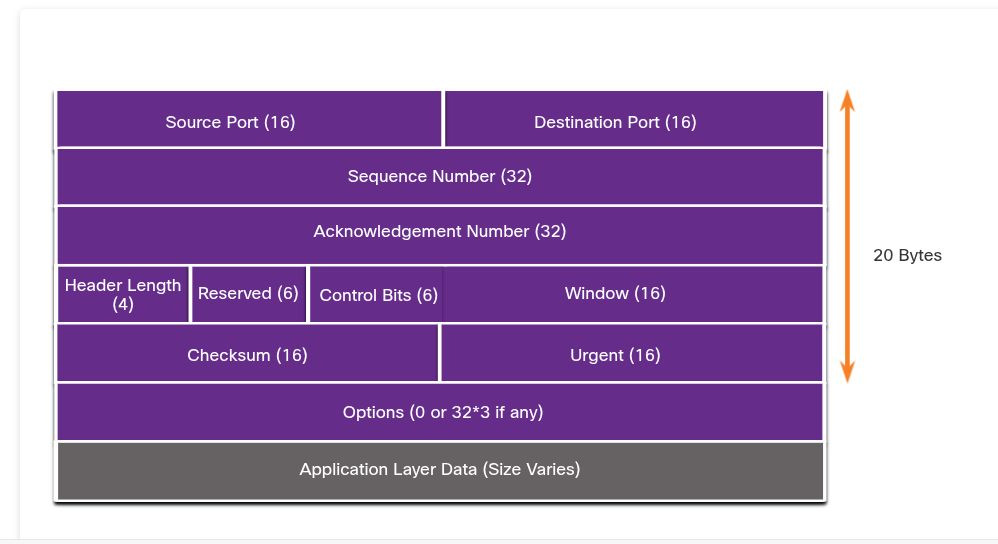

## TCP Header Fields
The table identifies and describes the ten fields in a TCP header.

|TCP Header Field|Description|
|----------------|-----------|
|Source Port| A 16-bit field used to identify the source application by port number|
|Destination Port|A 16-bit field used to identify the destination application by port number|
|Sequence Number|A 32-bit field used for data reassembly purposes|
|Sequence Number|A 32-bit field used for data reassembly purposes|
|Acknowledgement Number|A 32-bit field used to indicate that data has been recevied and the next byte expected from the source|
|Header Length|A 4-bit field known as "data offset" that indicates the length of the TCP segment header.|
|Reserved|A 6-bit field that is reserved for future use.|
|Control bits|A 6-bit field that includes bit codes, or flags, which indicates the purpose and function of the TCP segment.|
|Window size|A 16-bit field used to indicate the number of the bytes that can be accepted at one time.|
|Checksum|A 16-bit field used for error checking of the segment header and data.|
|Urgent|A 16-bit field used to indicate if the contained data is urgent.|

## Applications that use TCP
TCP is a good example of how the different layers of the TCP/IP protocol suite have specific roles. TCP handles all tasks associated with diciding the data stream into segments, providing reliability, controlling data flow, and reordering segments. TCP frees the application from having to manage any of these tasks. Applications can simply send the data stream to the transport layer and use the services of TCP.

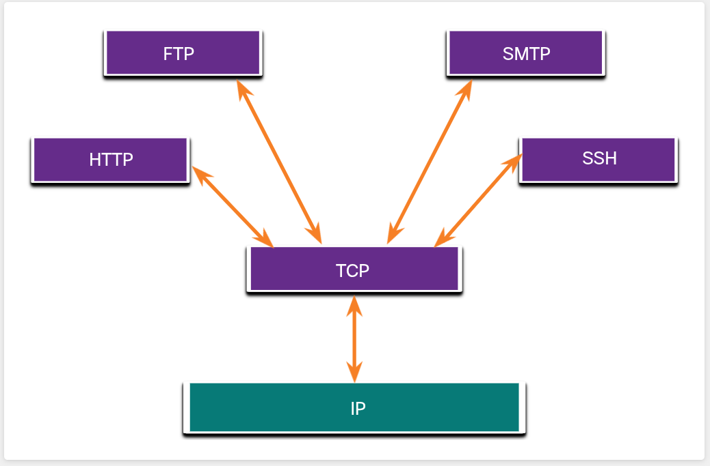

# UDP Overview
## UDP Features
UDP is a best-effort transport protocol. UDP is a lightweight transport protocol that offers the same data segmentation and reassembly as TCP, but without TCP reliability and flow control.

UDP is such a simple protocol that it is usually described in terms of what it does not do compared to TCP.

UDP features include the following:
- Data is reconstructed in the order that it is received.
- Any segments that are lost are not resent.
- There is no session establishment.
- The sending is not informed about resource availability.

## UDP Header
UDP is a stateless protocol, meaning neither the client, nor the server, tracks the state of the communication session. If reliability is required when using UDP as the transport protocol, it must be handled by the application.

One of the most important requirements for delivering live video and voice over the network is that the data continues to flow quickly. Live video and voice applications can tolerate some data loss with minimal or no noticeable effect, and are perfectly suited to the UDP.

The blocks of communication in UDP are called datagrams, or segments. These datagrams are sent as best effort by the transport layer protocol.

The UDP header is far simpler than the TCP header because it only has four fields and require 8 bytes (i.e., 64 bits).

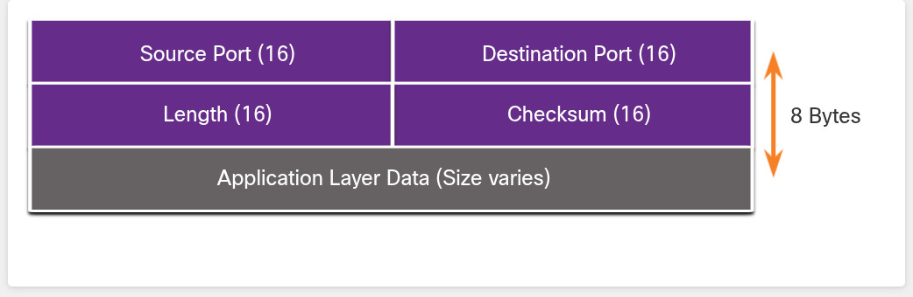

## UDP Header Fields
|UDP Header Field|Description|
|----------------|-----------|
|Source Port|A 16-bit field used to identify the source application by port number.|
|Destination Port|A 16-bit field used to identify the destination application by port number.|
|Length|A 16-bit field that indicates the length of the UDP datagram header.|
|Checksum|A 16-bit field used for error checking of the datagram header and data.|

## Applications that use UDP
There are three types of applications that are best suited for UDP:
- **Live video and multimedia applications** - These applications can tolerate some data loss, but require little or no delay. Examples include VoIP and live streaming video.
- **Simple request and reply applications** - Applications with simple transactions where a host sends a request and may or may not receive a reply. Examples include DNS and DHCP.
- **Applications that handle reliability themselves** - Unidirectional communications where flow control, error detection, acknowledgements, and error recovery is not required, or can be handled by the application. Examples include SNMP and TFTP.

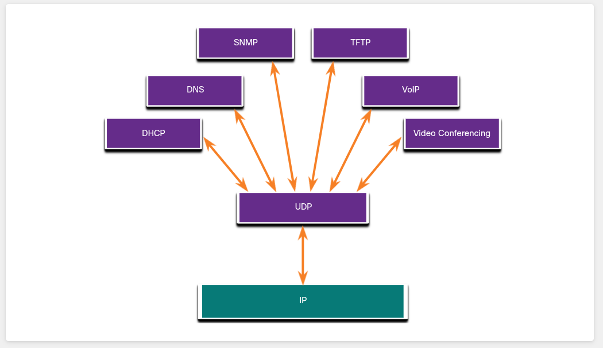

Although DNS and SNMP use UDP by defauly, both can also use TCP. DNS will use TCP if the DNS request or DNS response is more than 512 bytes, such as when a DNS response includes many name resolutions. Similarly, under some situations the network administrator may want to configure SNMP to use TCP.

# Port Numbers
## Multiple Separate Communications
There are some situations in which TCP is the right protocol for the job, and other situations in which UDP should be used. No matter what type of data is being transported, both TCP and UDP use port numbers.

The TCP and UDP transport layer protocols use port numbers to manage multiple, simultaneous conversations. The TCP and UDP header fields identify a source and destination application port number.

The source port number is associated with the originating application on the local host whereas the destination port number is associated with the destination application on the remote host.

For instance, assume a host is initiating a web page request from a web server. When the host initiates the web page request, the source port number is dynamically generated by the host to uniquely identify the conversation. Each request generated by a host will use a different dynamically created source port number. This process allows multiple conversations to occur simultaneously.

In the request, the destination port number is what identifies the type of service being requested of the destination web server. For example, when a client specifies port 80 in the destination port, the server that receives the message knows that web services are being requested.

A server can offer more than one service simultaneously such as web services on port 80 while it offers File Transfer Protoco (FTP) connection establishment on port 21.

## Socket Pairs
The source and destination ports are placed within the segment. The segments are then encapsulated within an IP packet. The IP packet contains the IP address of the source and destination. The combination of the source IP address and source port number, or the destination IP address and destination port number is known as a socket.

In the example image below, the PC is simultaneously requesting FTP and web services from the destination server.

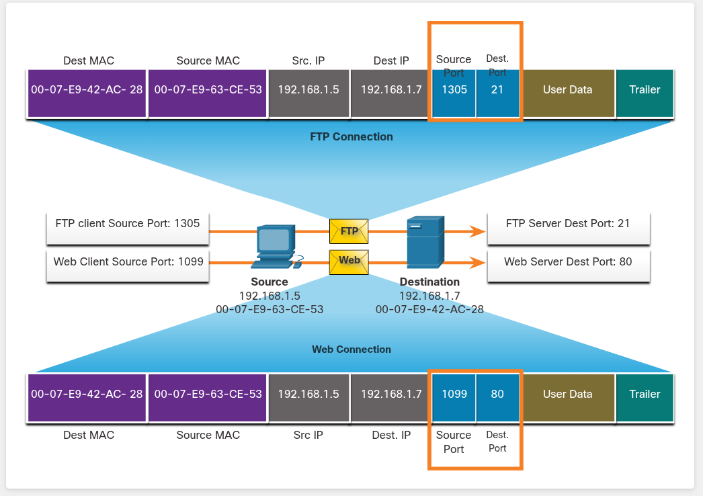

The FTP request generated by the PC includes the Layer 2 MAC addresses and the Layer 3 IP addresses. The request also identifies the source port number 1305 (i.e., dynamically generated by the host) and destination port, identifying the FTP services on port 21. The host also has requested a web page from the server using the same Layer 2 and Layer 3 addresses. However, it is using the source port number 1099 (i.e., dynamically generated by the host) and destination port identifying the web service on port 80.

The socket is used to identify the server and service being requested by the client. A client socket might look like this, with 1099 representing the source port number: 192.168.1.5:1099

The socket on a web server might be 192.168.1.7:80

Together, these two sockets combine to form a *socket pair*. 192.168.1.5:1099, 192.168.1.7:80

Sockets enable multiple processes, running on a client, to distinguish themselves from each other, and multiple connections to a server process to be distinguished from each other.

The source port number acts as a return address for the requesting application. The transport layer keeps track of this port and the application that initiated the request so that when a response is returned, it can be forwarded to the correct application.

## Port Number Groups
The Internet Assigned Numbers Authority (IANA) is the standards organization responsible for assigning various addressing standards, including the 16-bit port numbers. The 16 bits used to identify the source and destination port numbers provides a range of ports from 0 through 65535.

The IANA has divided the range of numbers into the following three port groups.

|Port Group|Number Range|Description|
|----------|------------|-----------|
|**Well-known Ports**|**0 to 1,023**| - These port numbers are reserved for common or popular services and applications  - Defined well-know ports for common server applications enables clients to easily identify the associated service required|
|**Registered Ports**|**1,024 to 49,151**| - These port numbers are assigned by IANA to a requesting entity to use with specific processes or applications.  - These processes are primarily individual applications that a user has chosen to install, rather than common applications that would receive a well-known port number.  - For example, Cisco has registered port 1812 for its RADIUS server authentication process.|
|**Private** and/or **Dynamic Ports**|**49,152 to 65,535**| - These ports are also known as *ephemeral ports*.  - The client's OS usually assign port numbers dynamically when a connection to a service is initiated.  - The dynamic port is then used to identify the client application during communication.|

**NOTE**: Some client operating systems may use registered port numbers instead of dynamic port numbers for assigning source ports.

Some applications may use both TCP and UDP. For example, DNS uses UDP when clients send requests to a DNS server. However, communication between two DNS servers always uses TCP.

## The netstat Command
Unexplained TCP connections can pose a major security threat. They can indicate something or someone is connected to the local host. Sometimes it is necessary to know which active TCP connections are open and running on a networked host. Netstat is an important network utility that can be used to verify those connections. As show below, enter the command netstat to list the protocols in use, the local address and port numbers, the foreign address and port numbers, and the connection state.

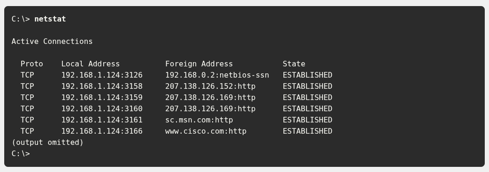

By default, the **netstat** command will attempt to resolve IP addresses to domain names and port numbers to well-known applications. The **-n** option can be used to display IP addresses and port numbers in their numerical form.

# TCP Server Processes
## TCP Server Processes
Each application process running on a server is configured to use a port number. The port number is either automatically assigned or configured manually by a system administrator.

An individual server cannot have two services assigned to the same port number within the same transport layer services. For example, a host running a web server application and a file transfer application cannot have both configured to use the same port, such as TCP port 80.

An active server application assigned to a specific port is considered open, which means that the transport layer accepts, and processes segments addressed to that port. Any port incoming client request addressed to the correct socket is accepted, and the data is passed to the server application. There can be many ports open simultaneously on a server, one for each active server application.

### Clients Sending TCP Requests
Client 1 is requesting web services and Client 2 is requesting email service of the same server.

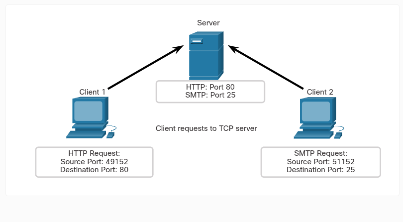

### Request Destination Ports
Client 1 is requesting web services using well-known port 80 (HTTP) and Client 2 is requesting email service using well-know port 25 (SMTP).

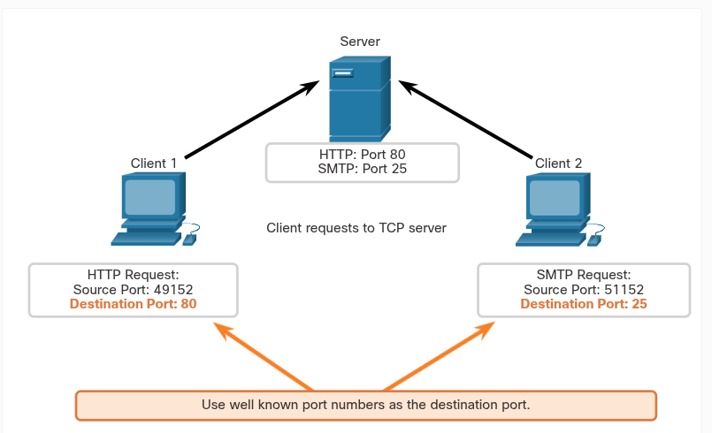

### Request Source Ports
Client requests dynamically generate a source port number. In this case, Client 1 is using source port 49152 and Client 2 is using source port 51152.

### Response Destination Ports
When the server responds to the client requests, it reverses the destination and source port of the initial request. Notice that the Server response to the web request now has destination port 49152 and the email response now has destination port 51152.

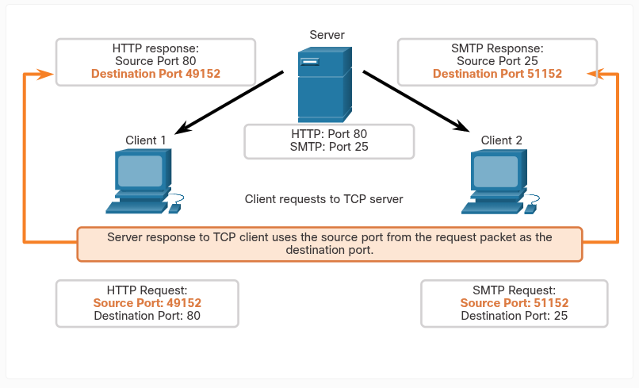

### Response Source Ports
The source port in the server response is the original destination port in the initial requests.

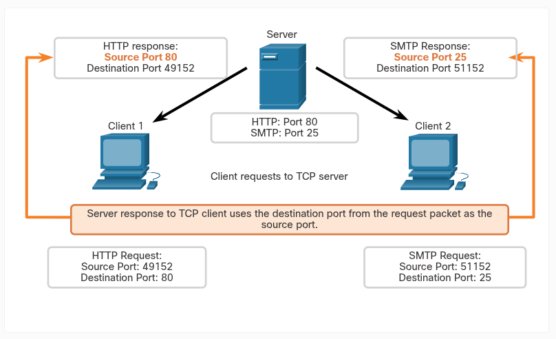

## TCP Connection Establishment
In TCP connections, the host client establishes the connection with the server using the three-way handshake process.

### Step 1. SYN
The initiating client requests a client-to-server communication session with the server.

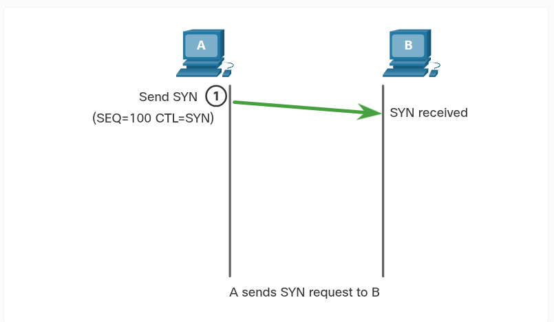

### Step 2. ACK and SYN
The server acknowledges the client-to-server communication session and requests a server-to-client communication session.

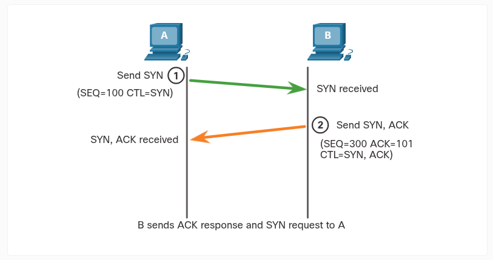

### Step 3. ACK
The initiating client acknowledges the server-to-client communicaiton session.

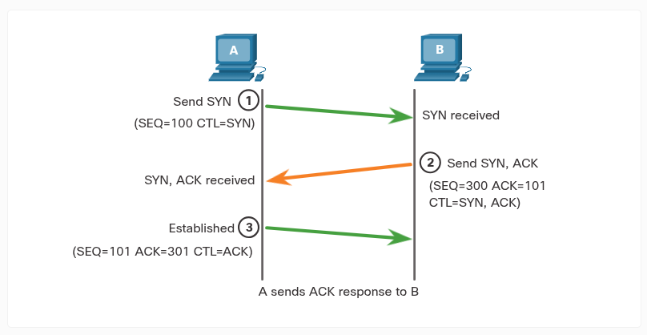

The three-way handshake validates that the destination host is available to communicate. In the above example, host A has validated that host B is available.

## Session Termination
To close a connection, the Finish (FIN) control flag must be set in the segment header. To end each one-way TCP session, a two-way handshake, consisting of a FIN segment and an Acknowledgement (ACK) segment, is used. Therefore, to terminate a single conversation supported by TCP, four exchanges are needed to end both sessions. Either the client or the server can initiate the termination.

### Step 1. FIN
When the client has no more data to send in the stream, it sends a segment with the FIN flag set.

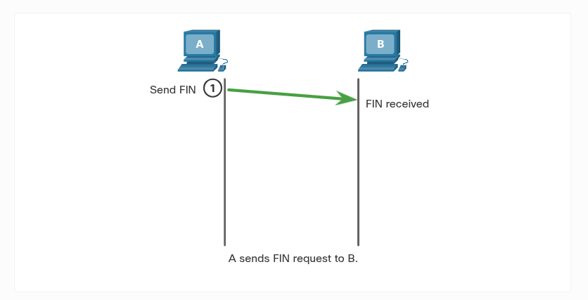

The three-way handshake validates that the destination host is available to communicate. In the above example, host A has validated that host B is available.

### Step 2. ACK and SYN
The server acknowledges the client-to-server communication session and requests a server-to-client communication session.

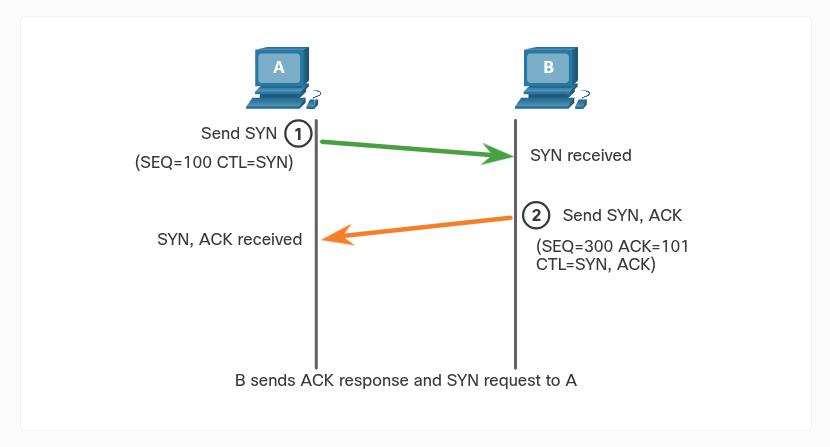

The three-way handshake validates that the destination host is available to communicate. In this example, host A has validated that host B is available.

### Step 3. ACK
The initiating client acknowledges the server-to-client communication session.

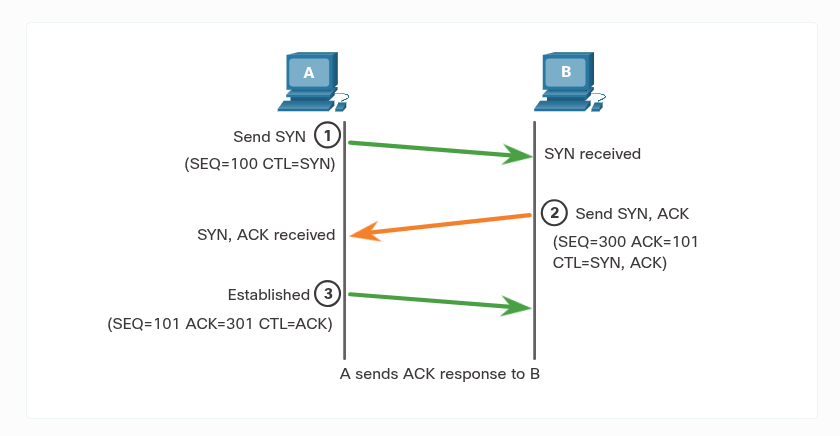

The three-way handshake validates that the destination host is available to communicate. In the example above, host A has validated that host B is available.

## Session Termination
To close a connection, the Finish (FIN) control flag must be set in the segment header. To end each one-way TCP session, a two-way handshake, consisting of a FIN segment and an Acknowledgment (ACK) segment, is used. Therefore, to terminate a single conversation supported by TCP, four exchanges are needed to end both sessions. Either the client or the server can initiate the termination.

## TCP Three-way Handshake Analysis
Hosts maintain state, trach each data segment within a session, and exchange information about what data is received using the information in the TCP header. TCP is a full-duplex protocol, where each connection represents two one-way communication sessions. To establish the connection, the hosts perform a three-way handshake. As shown in the figure below, control bits in the TCP header indicate the progress and status of the connection.

These are the functions of the three-way handshake:
- It establishes that the destination device is present on the network.
- It verifies that the destination device has an active service and is accepting requests on the destination port number that the initiating client intends to use.
- It informs the destination device that the source client intends to establish a communication session on that port number.

After the communication is completed, the sessions are closed, and the connection is terminated. The connection and session mechanisms enable TCP reliability function.

### Control Bits Field

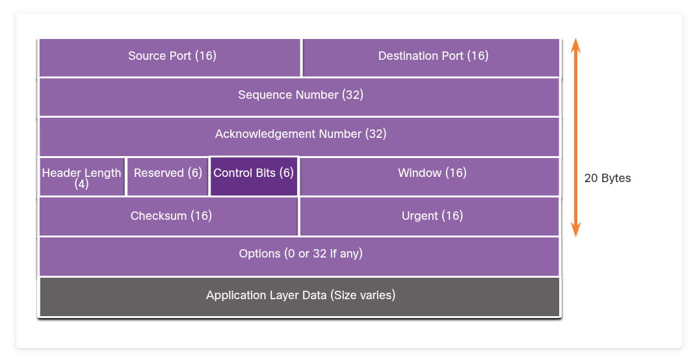

The six bits in the Control Bits field of the TCP segment header are also known as flags. A flag is a bit that is set to either on or off.

The six control bits flags are as follows:
- ***URG*** - Urgent pointer field significant
- ***ACK*** - Acknowledgment flag is used in connection establishment and session termination
- ***PSH*** - Push function
- ***RST*** - Reset the connection when an error or timout occurs
- ***SYN*** - Synchronize sequence numbers used in connection establishment
- ***FIN*** - No more data from sender and used in session termination.

# TCP Reliability - Guaranteed and Ordered Delivery
The reason that TCP is the better protocol for some applications is because, unlike UDP, it resend dropped packets and number of packets to indicate their proper order before delivery. TCP can also help maintain the flow of packets so that devices do not become overloaded. This topic covers these features of TCP in detail.

There may be times when TCP segments do not arrive at their destination. Other times, the TCP segments might arrive out of order. For the original message to be understood by the recipient, all the data must be received and the data in these segments must be reassembled in the header of each packet to achieve this goal. The sequence number represents the first data byte of the TCP segment.

During session setup, an initial sequence number (ISN) is set. This ISN represents the starting value of the bytes that are transmitted to the receiving application. As data is transmitted during the session, the sequence number is incremented by the number of bytes that have been transmitted. This data byte tracking enables each segment to be uniquely identified and acknowledged. Missing segments can then be identified.

The ISN does not begin at one but is effectively a random number. This is to prevent certain types of malicious attacks. For simplicity, the figure example below will use an ISN of 1.

Segment sequence numbers indicate how to reassemble and reorder received segments.

### TCP Segments are Reordered at the Destination

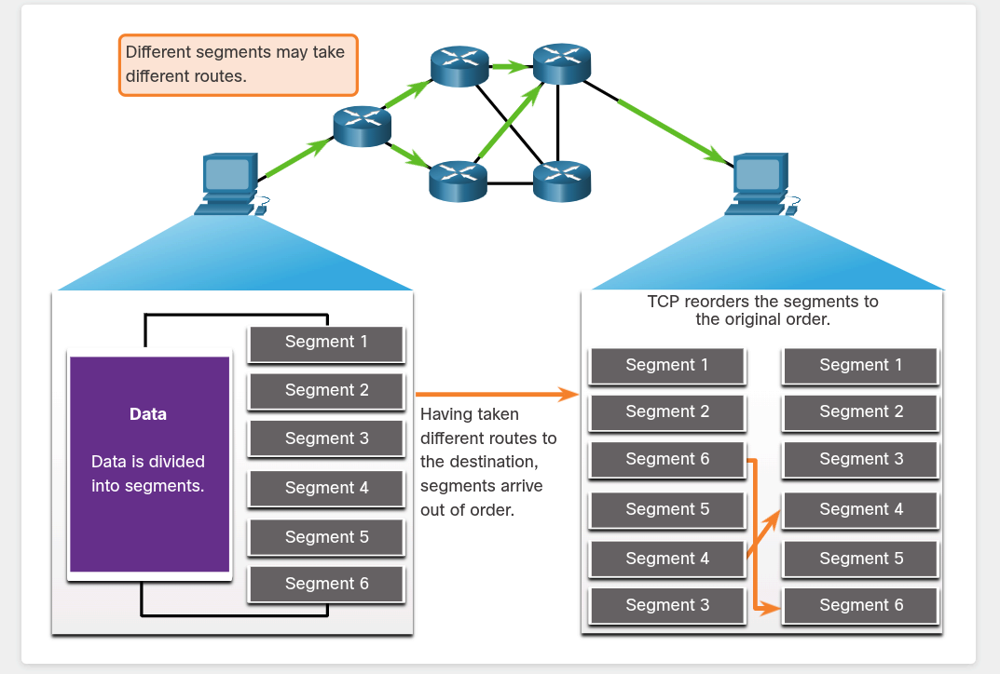

The receiving TCP process places the data from a segment into a receiving buffer. Segments are then placed in the proper sequence order and passed to the application layer when reassembled. Any segments that arrive with sequence numbers that are out of order are held for later processing. Then, when the segments with the missing bytes arrive, these segments are processed in order.

## TCP Reliability - Sequence Numbers and Acknowledgements

One of the functions of TCP is to ensure that each segment reaches its destination. The TCP services on the destination host acknowledge the data that have been received by the source application.

## TCP Reliability - Data Loss and Retransmission

No matter how well designed a network is, data loss occasionally occurs. TCP provides methods of managing these segment losses. Among these is a mechanism to retransmit segments for unacknowledged data.

The sequence (SEQ) number and acknowledgement (ACK) number are used together to confirm receipt of the bytes of data contained in the transmitted segments. The SEQ number identifies the first byte of data in the segment being transmitted, TCP uses the ACk number sent back to the source to indicate the next byte that the receiver expects to receive. This is called expectational acknowledgement.

Host operating systems today typically employ an optional TCP feature called selective acknowledgment (SACK), negotiated during the three-way handshake. If both hosts support SACK, the receiver can explicitly acknowledge which segments (byte) were received including discontinuous segments. The sending host would therefore only need to retransmit the missing data.

**Note**: TCP typically sends ACKs for every other packet, but other factors beyond the scope of this topic may alter this behavior. TCP uses timers to know how long to wait before resending a segment.

## TCP Flow Control - Maximun Segment Size (MSS)
The MSS is part of the options field in the TCP header that specifies the largest amount of data, in bytes, that a device can receive in a single TCP segment. The MSS size does not include the TCP header. The MSS is typically included during the three-way handshake.

A common MSS is 1,460 bytes when using IPv4. A host determines the value of its MSS field by subtracting the IP and TCP headers from the Ethernet maximun transmission unit (MTU). On an Ethernet interface, the default MTU is 1500 bytes. Subtracting the IPv4 header of 20 bytes and the TCP header of 20 bytes, the default MSS size will be 1460 bytes, as shown in the figur below.

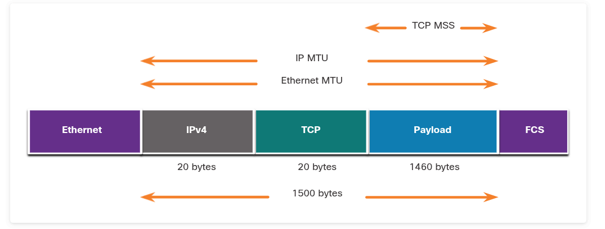

# UDP Communication
## UDP Low Overhead versus Reliability
UDPis perfect for communications that need to be fast, like VoIP. UDP does not establish a connection. It provides low overhead data transport because it has a small datagram header and no network management traffic.

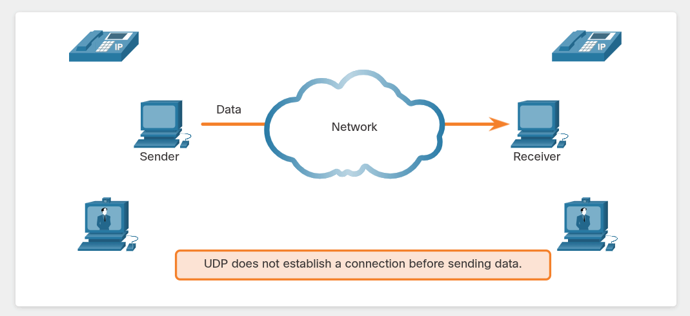

## UDP Datagram Reassembly
Like segments with TCP, when UDP datagrams are sent to a destination, they often take different paths and arrive in the wrong orderl UDP does not track sequence numbers the way TCP does. UDP has no way to reorder the datagrams into their transmission order.

Therefore, UDP simply reassembles the data in the order that it received and forward it to the application. If the data sequence is important to the application, the application must identify the proper sequence and determine how the data should be processed.

### UDP: Connectionless and Unreliable

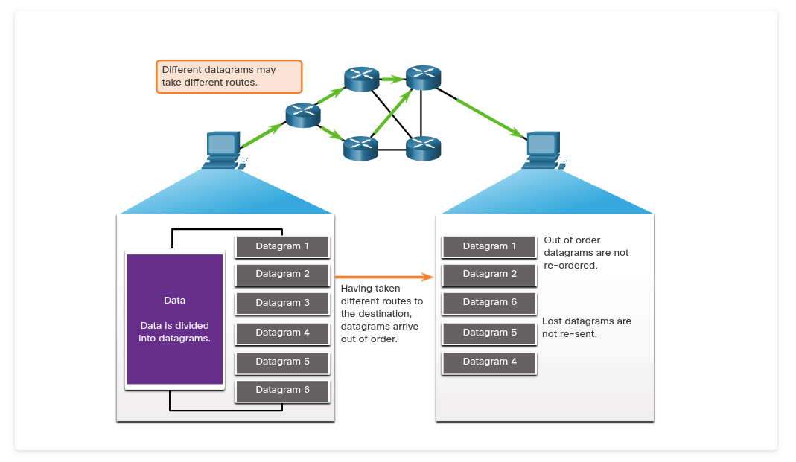

## UDP Server and Processes and Requests
Like TCP-based applications, UDP-based server applications are assigned well-known or registered port numbers. When these applications or processes are running on a server, they accept the data matched with the assigned port number. When UDP receives a datagram destined for one of these ports, it forwards the application data to the appropriate application based on its port number.

### UDP Server Listening for Requests

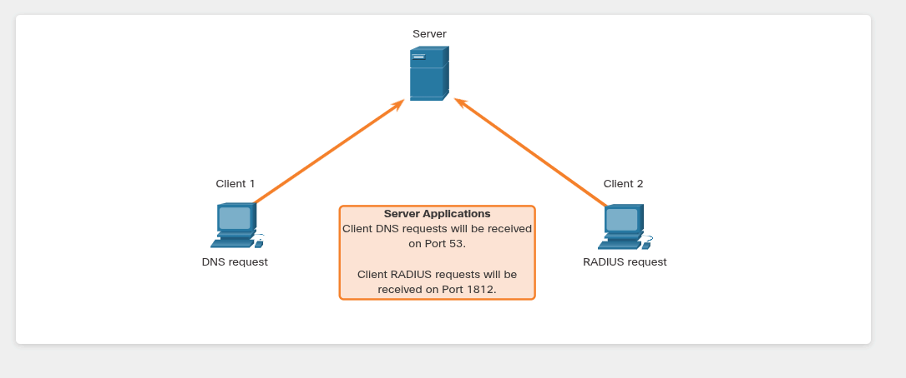

## UDP Client Processes
As with TCP, client-server communication is initiated by a client application that requests data from a server process. The UDP client process dynamically selects a port number from the range of port numbers and uses this as the source port for the conversation. The destination port is usually the well-known or registered port number assigned to the server process.

After a client has selected the source and destination ports, the same pair of ports are used in the header of all datagrams in the transaction. For the data returning to the client from the server, the source and destination port numbers in the datagram header are reversed.
