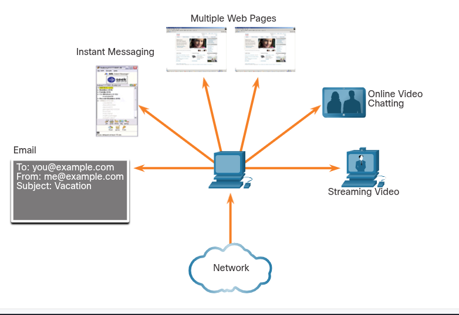
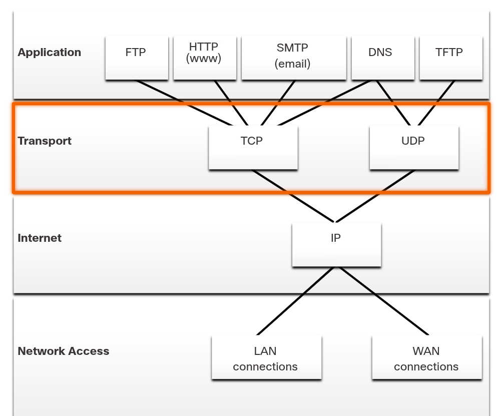
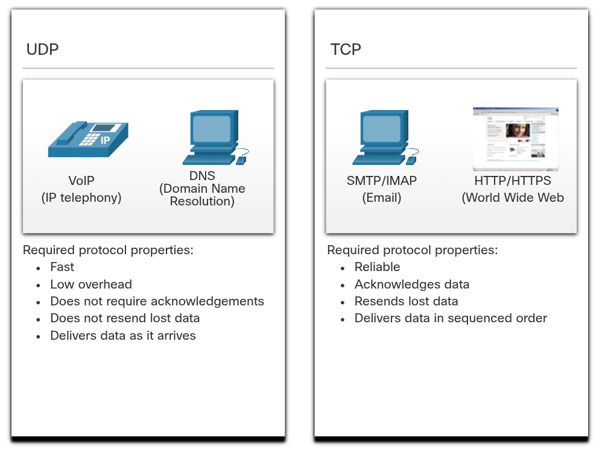

# Transportation of Data
## Role of the Transport Layer
The transport layer is responsible for logical communications between applications running on different hosts. This may include services such as establishing a temporary session between two hosts and the reliable transmission of information for an application.

The transport layer is the link between the application layer and the lower layers that are responsible for network transmission.

The transport layer has no knowledge of the destination host type, type of media over which the data must travel, path taken by the data, congestion on a link, or the size of the network.

### The transport layer includes two protocols:
- Transmission Control Protocol (TCP)
- User Datagram Protocol (UDP)

## Transport Layer Responsibilities
The transport layer has many responsibilities:
- Tracking Individual Conversation

    At the transport layer, each set of data flowing between a source application and a destination applicaiton is known as a conversation and is tracked separately. It is the responsibility of the transport layer to maintain and track these multiple conversations.

    A host may have multiple applications that are communicating across the network simultaneously. Most networks have a limitation on the amount of data that can be included in a single packet. Therefore, data must be divided into manageable pieces.

- Segmenting Data and Reassembling Segments

    It is the transport layer responsibility to divide the application data into appropriately sized blocks. Depending on the transport layer protocol used, the transport layer blocks are called either segments or datagrams. The transport layer divides the data into smaller blocks (i.e., segments or datagrams) that are easier to manage and transport.

- Add Header Information

    The transport layer protocol also adds header information containing binary data organized into several fields to each block of data. It is the values in these fields that enable various transport layer protocols to perform different functions in managing data communication.

    For instance, the header information is used by the receiving host to reassemble the blocks of data into a complete data stream for the receiving application layer program.

    The transport layer ensures that even with multiple application running on a device, all applications receive the correct data.

- Identifying the Applications

    The transport layer must be able to separate and manage multiple communications with different transport requirement needs. To pass data streams to the proper applications, the transport layer identifies the target application using an identifier called a port number. Each software process needs to access the network is assigned a port number unique to that host.

- Conversation Multiplexing

    Sending some types of data (e.g., a streaming video) across a network, as one complete communication stream, can consume all the available bandwidth. This would prevent other communication conversations from occuring at the same time. It would also make error recovery and retransmission of damaged difficult.

    The transport layer uses segmentation and multiplexing to enable different communication conversations to be interleaved on the same network.

    Error checking can be performed on the data in the segment, to determine if the segment was altered during transmission.

## Transport Layer Protocols
IP is concerned only with the structre, addressing, and routing of packets. IP does not specify how the delivery or transportation of the packets takes place.

Tranport layer protocols specify how to transfer messages between hosts, and are responsible for managing reliability requirements of a conversation. The transport layer includes the TCP and UDP protocols.

Different applications have different transport reliability requirements. Therefore, TCP/IP provides two transport layer protocols.

## Transmission Control Protocol (TCP)
IP is concerned only with the structure, addressing, and routing of packets, from original sender to final destination. IP is not responsible for guaranteeing delivery or determining whether a connection between the sender and receiver needs to be established.

TCP is considered a reliable, full-featured transport layer protocol, which ensures that all of the data arrives at the destination. TCP includes fields which ensure the delivery of the application data. These fields require additional processing by the sending and receiving hosts.

NOTE: TCP divides data into segments.

TCP transport is analogous to sending packages that are tracked from source to destination. If a shipping order is broken up into several packages, a customer can check online to see the order of the delivery.

TCP provides reliability and flow control using these basic operations:
- Number and track data segments transmitted to a specific host from a specific application
- Acknowledge received data
- Retransmit any unacknowledged data after a certain amount of time
- Sequence data that might arrive in wrong order
- Send data at an efficient rate that is acceptable by the receiver

To maintain the state of a conversation and track the information, TCP must first establish a connection between the sender and the receiver. This is why TCP is known as a connection-oriented protocol.

## User Datagram Protocol (UDP)
UDP is a simpler transport layer protocol than TCP. It does not provide reliability and flow control, which means it requires fewer header fields. Because the sender and the receiver UDP processes do not have to manage reliability and flow control, this mean UDP datagrams can be processed faster than TCP segments. UDP provides the basic functions for delivering datagrams between the appropriate applications, with very little overhead and data checking.

NOTE: UDP divides data into datagrams that are also referred to as segments.

UDP is a connectionless protocol. Because UDP does not provide reliability or flow control, it does not require an established connection. Because UDP does not track information sent or received between the client and server, UDP is also known as a stateless protocol.

UDP is also known as a best-effort delivery protocol because there is no acknowledgement that the data is received at the destination. With UDP, there are no transport layer processess that inform the sender of a successful delivery.

UDP is like placing a regular, non-registered, letter in the mail. The sender of the letter is not aware of the availability of the receiver to receive the letter. Nor is the post office responsible for tracking the letter or informing the sender if the letter does not arrive at the final destination.

## The Right Transport Layer Protocol for the Right Application
Some applications can tolerate some data loss during transmission over the network, but delays in transmission is unacceptable. For these applications, UDP is the better choice because it requires less network overhead. UDP is preferable for applications such as Voice over IP (VoIP). Acknowledgements and retransmission would slow down delivery and make the voice conversation unacceptable.

UDP is also used by request-and-reply applications where the data is minimal, and retransmission can be done quickly. For example, Domain Name System (DNS) uses UDP for this type of transaction. The client requests IPv4 and IPv6 addresses for a known domain name from a DNS server. If the client does not receive a response in a predetermined amount of time, it simply sends the request again.

For other applications it is important that all the data arrives and that it can be processed in its proper sequence. For these types of applications, TCP is used as the transport protocol. For example, applications such as databases, web browsers, and email clients, require that all data that is sent arrives at the destination in its original condition. Any missing data could corrupt a communication, making it either incomplete or unreadable. Another example, it is important when accessing bank information over the web to make sure all the information is sent and received correctly.

Application developers must choose which transport protocol type is appropriate based on the requirements of the applications. Video may be sent over TCP or UDP. Applications that stream stored audio and video typically use TCP. The application uses TCP to perform buffering, bandwidth probing, and congestion control, in order to better control the user experience.

Real-time video and voice usually use UDP, but may also use TCP, or both UDP and TCP. A video conferencing application may use UDP by default, but many firewalls block UDP, the application can also be sent over TCP.

Applications that stream stored audio and video use TCP. For example, if our network suddenly cannot support the bandwidth needed to watch an on-demand move, the application pauses the playback. During the pause, we might see a "buffering..." message while TCP works to re-establish the stream. When all the segments are in order and a minimum level of bandwidth is restored, the TCP session resumes, and the movie resumes playing.

