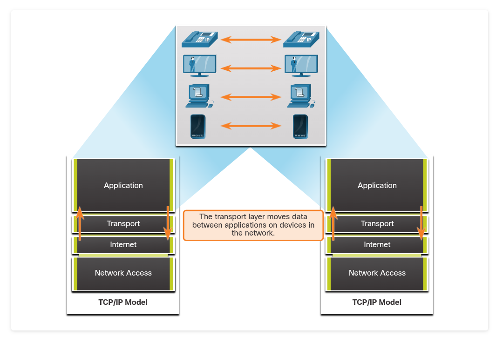
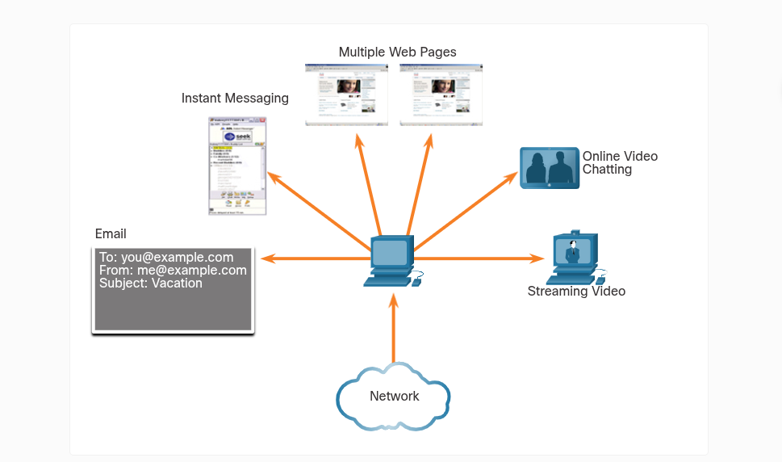
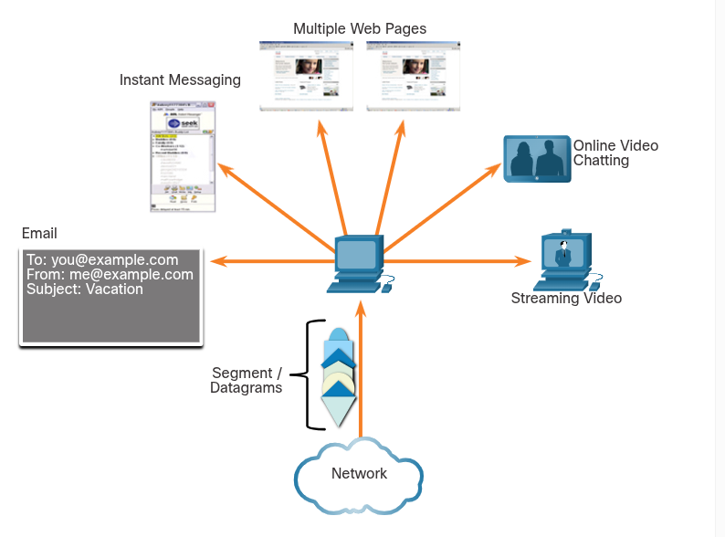
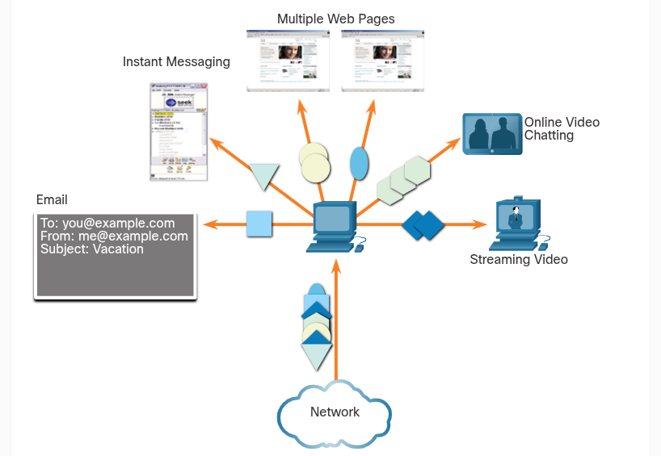
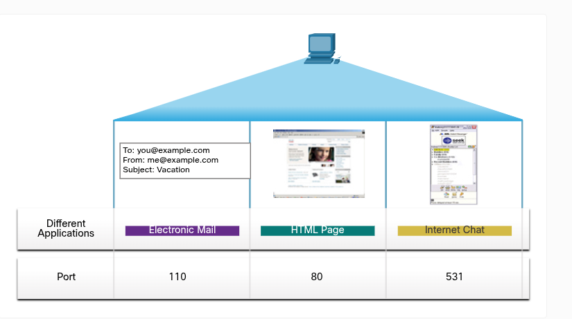

# Transportation of Data
## Role of the Transport Layer
The transport layer is responsible for logical communications between applications running on different hosts. This may include services such as establishing a temporary session between two hosts and the reliable transmission of information for an application.

The transport layer is the link between the application layer and the lower layers that are responsible for network transmission.

The transport layer has no knowledge of the destination host type, type of media over which the data must travel, path taken by the data, congestion on a link, or the size of the network.

### The transport layer includes two protocols:
- Transmission Control Protocol (TCP)
- User Datagram Protocol (UDP)

# Transport Layer Responsibilities
The transport layer has many responsibilities:
- Tracking Individual Conversation

    At the transport layer, each set of data flowing between a source application and a destination applicaiton is known as a conversation and is tracked separately. It is the responsibility of the transport layer to maintain and track these multiple conversations.

    A host may have multiple applications that are communicating across the network simultaneously. Most networks have a limitation on the amount of data that can be included in a single packet. Therefore, data must be divided into manageable pieces.

- Segmenting Data and Reassembling Segments

    It is the transport layer responsibility to divide the application data into appropriately sized blocks. Depending on the transport layer protocol used, the transport layer blocks are called either segments or datagrams. The transport layer divides the data into smaller blocks (i.e., segments or datagrams) that are easier to manage and transport.

- Add Header Information

    The transport layer protocol also adds header information containing binary data organized into several fields to each block of data. It is the values in these fields that enable various transport layer protocols to perform different functions in managing data communication.

    For instance, the header information is used by the receiving host to reassemble the blocks of data into a complete data stream for the receiving application layer program.

    The transport layer ensures that even with multiple application running on a device, all applications receive the correct data.

- Identifying the Applications

    The transport layer must be able to separate and manage multiple communications with different transport requirement needs. To pass data streams to the proper applications, the transport layer identifies the target application using an identifier called a port number. Each software process needs to access the network is assigned a port number unique to that host.

