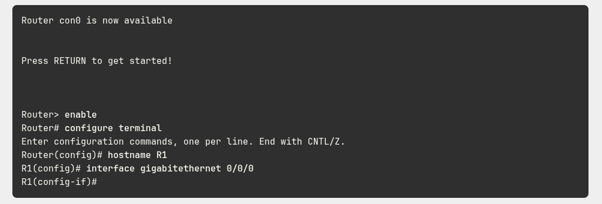
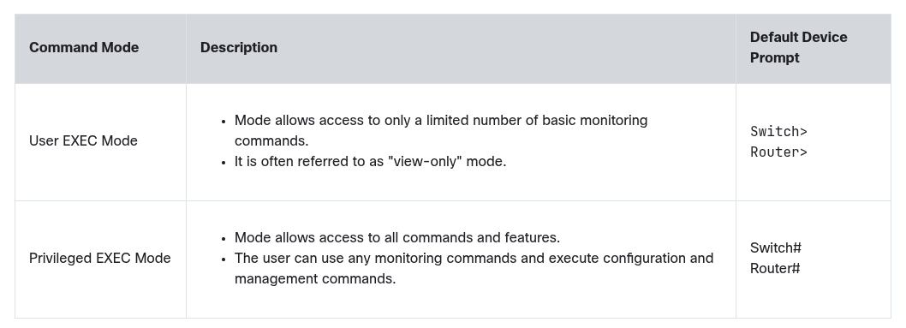
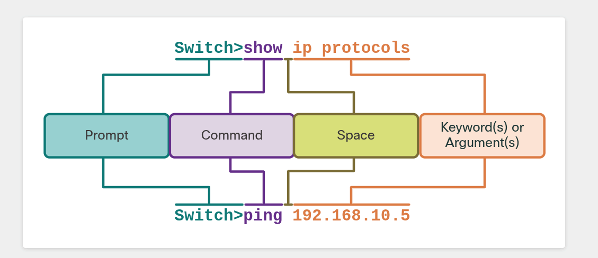
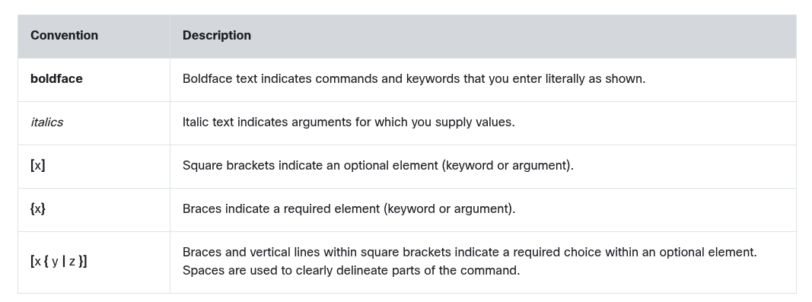

# Cisco IOS Command Line Interface
The Cisco IOS command line interface (CLI) is a text-based program that enables entering and executing Cisco IOS commands to configure, monitor, and maintain Cisco devices. The Cisco CLI can be used with either in-band or out-of-band management tasks.

CLI commands are used to alter the configuration of the device and to display the current status of processes on the router. For experienced users, the CLI offers many time-saving features for creating both simple and complex configurations. Almost all Cisco netowkring devices use a similar CLI. When the router has completed the power-up sequence and the **Router>** prompt appears, the CLI can be used to enter Cisco IOS commands.

## Primary Command Modes
All network devices require an OS and that they can be configured using the CLI or a GUI. Using the CLI may provide the network administrator with more precise control and flexibility that using the GUI. This topic discusses using CLI to navigate the Cisco IOS.

As a security feature, the Cisco IOS software separates management access into the following two command modes:
- **User EXEC Mode** - This mode has limited capabilities but is useful for basic operations. It allows only a limited number of basic monitoring commands but does not allow the execution of any commands that might change the configuration of the device. The user EXEC mode is identified by the CLI prompt that ends with the > symbol.
- **Privileged EXEC Mode** - To execute configuration commands, a network administrator must access priviledged EXEC mode. Higher configuration modes, like global configuration mode, can only be reached from privileged EXEC mode. The privileged EXEC mode can be identified by the prompt ending with the # symbol.

The figure below summarized the two modes and displays the default CLI prompts of a Cisco switch and router.

# The Command Structure
## Basic IOS Command Structure
A network administrator must know the basic IOS command structure to be able to use the CLI for device configuration.

A Cisco IOS device supports many commands. Each IOS command has a specific format, or syntax, and can only be executed in the appropriate mode. The general syntax for a command is the command followed by any appropriate keywords and arguments.

- **Keyword** - This is a specific parameter defined in the operating system (in the figure above, **ip protocols**)
- **Argument** - This is not predefined; it is a value or variable defined by the user (in the figure above, **192.168.10.5**)

## IOS Command Syntax
A command might require one or more arguments. To determine the keywords and arguments requoired for a command, refer to the command syntax. The syntax provides the pattern, or format, that must be used when entering a command.

In the figure below, boldface text indicates commands and keywords that are entered as shown. Italic text indicates an argument for which the user provides the value.

For instance, the syntax for using the **description** command is **description** *string*. The argument is a *string* value provided by the user. The **description** command is typically used to identify the purpose of an interface.

The following examples demonstrate conventions used to document and use IOS commands:
- **ping** *ip-addess* - the command is **ping** and the user-defined argument of *ip-address* is the IP address of the destination device.
- **traceroute** *ip-address* - The command **traceroute** and the user-defined argument of *ip-address* is the IP address of the destination device.

If a command is complex with multiple arguments, we may see it represented like this:

    Switch(config-if)# switchport port-security aging { static | time time | type {absolute | inactivity}}

The command will typically be followed with a detailed description of the command and each argument in the Cisco IOS Command reference.
