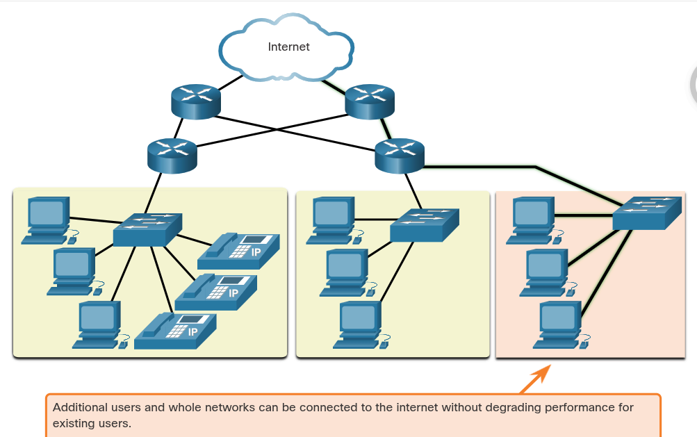

### Network Design
## Reliable Networks
    A fault tolerant network limits the number of affected devices during a failure. It allows quick recovery when such a failure occurs. These networks depend on multiple paths between the source and destination of a message. If one path fails, the messages are instantly sent over a different link.
    A scalable network expands quickly to support new users and applications. It does this without degrading the performance of services that are being accessed by existing users. Networks can be scalable because the designers follow accepted standards and protocols.
    QoS is an increasing requirement of networks today. As data, voice, and video content continue to converge onto the same network, QoS becomes a primary mechanism for managing congestion and ensuring reliable delivery of content to all users. Network bandwidth is measured in bps. When simultaneous communications are attempted across the network, the demand for network bandwidth can exceed its availabilitu, creating network congestion. The focus of QoS is prioritize time-sensitive traffic. The type of traffic, not content of the traffic, is what is important.
    Network administrators must address two types of network security concerns: network infrastructure security and information security. Network administrators must also protect the information contained within the packets being transmitted over the network, and the information stored on network attached devices. There are three primary requirements to achieve the goals of network security: Confidentiality, Integrity, and Availability.

# Network Architecture
    The role of the network has changed from a data-only network to a system that enables the connections of people, devices, and information in a media-rich, converged network environment. For networks to function efficiently and grow in this type of environment, the network must be built upon a standard network architecture.
    Networks also support a wide range of applications and services. They must operate over many different types of cables and devices, which make up the physical infrastructure. The term network architecture, in this contect, refers to the technologies that support the infrastructure and the programmed services and rules, or protocols, that move data across the network.
    As networks evolve, we have learned that there are four basic characteristics that network architects must address to meet user expectations:
        Fault Tolerance
        Scalability
        Quality of Service (QoS)
        Security

# Fault Tolerance
    A fault tolerant network is one that limits the number of affected devices during a failure. It is built to allow quick recovery when such a failure occurs. These networks depend on multiple paths between the source and destination of a message. If one path fails, the messages are instantly sent over a different link. Having multiple paths to a destination is known as redundancy.
    Implementing a packet-switched network is one way that reliable networks provide redundancy. Packet switching splits traffic into packets that are routed over a shared network. A single message, such as an email or a video stream, is broken into multiple message blocks, called packets. Each packet has the necessary addressing information of the source and destination of the message. The routers within the network switch the packets based on the condition of the network at that moment. This means that all the packets in a single message could take very different paths to the same destination.

# Scalability
    A scalable network expands quickly to support new users and applications. It does this without degrading the performance of services that are being accessed by existing users.
        The figure below shows how a new network can easily be added to an existing network.

            

        These networks are scalable because the designers follow accepted standards and protocols. This lets software and hardware vendors focus on improving products and services without having to design a new set of rules for operating within the network.

# Quality of Service
    Quality of Service (QoS) is an increasing requirement of networks today. New applications available to users over networks, such as voice and live transmissions, create higher expectations for the qualtiy of the delivered services.
    As data, voice, and video content continue to converge onto the same network, QoS becomes a primary mechanism for managing congestion and ensuring reliable delivery of content to all users.
    Congestion occurs when the demand for bandwitdth exceeds the amount available. Network bandwidth is measured in the number of bits that can be transmitted in a single second, or bits per second (bps). When simultaneous communications are attempted across the network, the demand for network bandwidth can exceed its availability, creating network congestion.
    When the volume of traffic is greater than what can be transported across the network, devices will hold the packets in memory ntil resources become available to transmit them. The focus of QoS is to prioritize time-sensitive traffic. The type of traffic, not the content of the traffic, is what is important.

# Network Security
    The network infrastructure, services, and the data contained on network-attached devices are crucial personal and business assets. Network administrators must address two types of network security concers: network infrastructure security and information security.
    Securing the network infrastructure includes physically securing devices that provide network connectivity and preventing unauthorized access to the management software that resides on them.
    Network administrators must also protect the information contained within the packets being transmitted over the network, and the information stored on the network attached devices. In order to achieve the goals of network security, there are three primary requirements.

        Confidentiality
            Data confidentiality means that only the intended and authorized recipients can access and read data
        Integrity
            Data integrity assures users that the information has not been altered in transmission, from origin to destination
        Availability
            Data availability assures users of timely and reliable access to data services for authorized users

## Hierarchical Network Design
    IP addresses contain two parts. One part identifies the network portion. The network portion of the IP address will be the same for all hosts connected to the same local network. The second part of the IP address identifies the individual host on that network. Both the physical MAC and logical IP addresses are required for a computer to communicate on a hierarchical network.
    The Network and Sharing Center on a PC shows your basic network information and set up connections, including your active networks and whether you are connected wired or wirelessly to the internet and within your LAN. You can view the properties of your connections here.
    On an Ethernet network, the host MAC address is similar to a person's name. A MAC address indicates the individual identity of a specific host, but it does not indicate where on the network the host is located.
    
    Hierarchical networks scale well. The access layer provides a connection point for end user devices to the network and allows multiple hosts to connect to other hosts through a network device, usually a switch or a wireless access point. Typically, all devices within a single access layer will have the same network portion of the IP address. The distribution layer provides a connection point for separate networks and controls the flow of information between the networks. Distribution layer devices control the type and amount of traffic that flows from the access layer to the core layer. The core layer is a high-speed backbone layer with redundant connections. It is responsible for transporting large amounts of data between multiple end networks. The main goal of the core layer is to transport data quickly.

# Physical and Logical Addresses
    A person's name usually does not change. A person's address on the other hand, relates to where the person lives and can change. On a host, the MAC address does not change; it is physically assigned to the host NIC and is known as the physical address. The physical address remains the same regardless of where the host is placed on the network.
    The IP address is similar to the address of a person. It is known as logical address because it is assigned logically based on where the host is located. The IP address, or network address, is assigned to each host by a network administrator based on the local network.
    IP addresses contain two parts. One part identifies the network portion. The network portion of the IP address will be the same for all hosts connected to the same local network. The second part of the IP address identifies the individual host on that network. Within the same local network, the host portion of the IP address is unique to each host.
    Both the physical MAC and logical IP addresses are required for a computer to communicate on a hierarchical network, just like both the name and address of a person are required to send a letter.

# Hierarchical Analogy
    On an Ethernet network, the host MAC address is similar to a person's name. A MAC address indicates the individual identity of a specific host, but it does not indicate where on the network the host is located. If all hosts on the internet (millions and millions of them) were each identified by their unique MAC address only, imagine how difficult it would be to locate a single one.
    Additionally, Ethernet technology generates a large amount of broadcast traffic in order for hosts to communicate. Broadcasts are sent to all hosts within a single network. Broadcasts consume bandwidth and slow network performance. What would happen if millions of hosts atttached to the internet were all in one Ethernet network and were using broadcasts?
    For these reasons, large Ethernet network consisting of many hosts are not efficient. It is better to divide larger networks into smaller, more manageable pieces. One way to divide larger networks is to use a hierarchical design model.

# Access, Distribution, and Core
    IP traffic is managed based on the characteristics and devices associated with each of the three layers of the hierarchical network design model: Access, Distribution and Core.

        Access Layer
            The access layer provides a connection point for end user devices to the network and allows multiple hosts to connect to other hosts through a network device, usually a switch, or a wireless access point. Typically, all devices within a single access layer will have the same network portion of the IP address.
            If a message is destined for a local host, based on the network portion of the IP address, the message remains local. If it is destined for a different network, it is passed up to the distribution layer. Switches provide the connection to the distribution layer devices, usually a Layer 3 device such as a router or Layer 3 switch.

        Distribution Layer
            The distribution layer provides a connection point for separate networks and controls the flow of information between the networks. It typically contains more powerful switches, than the access layer as well as routers for routing between networks. Distribution layer devices control the type and amount of traffic that flows from the access layer to the core layer.

        Core Layer
            The core layer is a high-speed backbone layer with redundant (backup) connections. It is responsible for transporting large amounts of data between multiple end networks. Core layer devices typically include very powerful, high-speed switches and routers. The main goal of the core layer is to transport data quickly.

