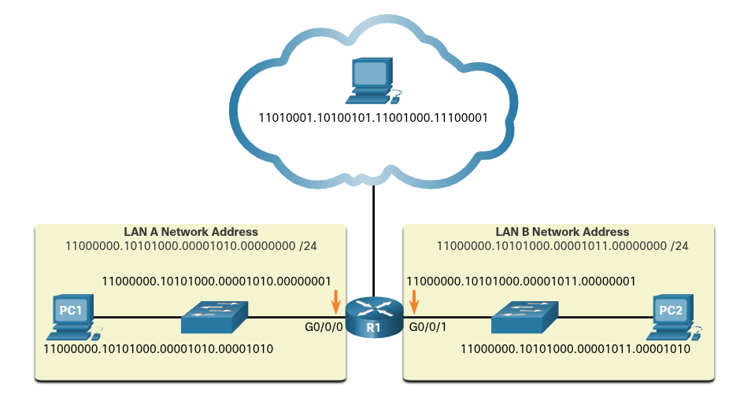
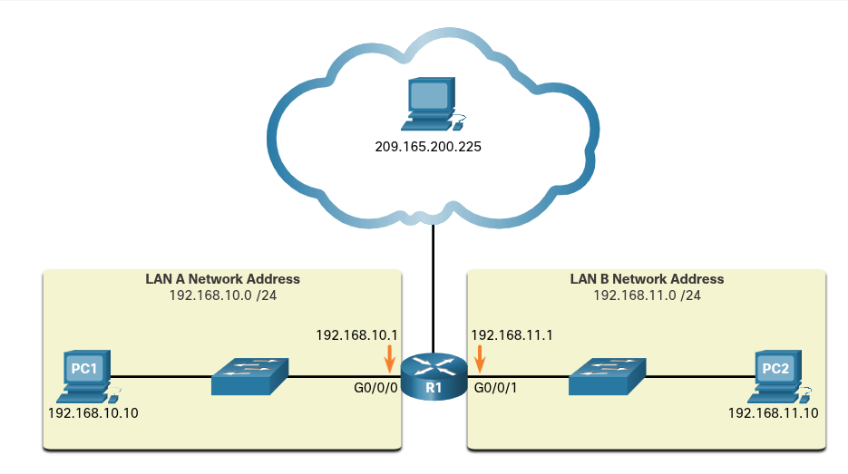

### Binary Systems

## Binary Number System
# Binary and IPv4 Addresses
    IPv4 addresses begin as binary, a series of only 1s and 0s. These are difficult to manage, so network administrators must convert them to decimal.
    Binary is a numbering system that consists of digits 0 and 1 called bits. In contrast, the decimal numbering system consists of 10 digits which includes 0 through 9.
    Binary is important for us to understand because hosts, servers, and network device use binary addressing. Specifically, they use binary IPv4 addresses, as shown in the figure below, to identify each other.

        

    Each address consists of a string of 32 bits, divided into four sections called octets. Each octet contains 8 bits (or 1 byte) separated with a dot. For example, PC1 in the figure above is assigned IPv4 address 11000000.10101000.00001010.00001010. It's default gateway address would be that of R1 Gigabit Ethernet interface 11000000.10101000.00001010.00000001. Binary works well with hosts and network devices. However, it is very challenging for humans to work with.

    For ease of use by people, IPv4 addresses are commonly expressed in dotted decimal notation. PC1 in the figure below, is assigned with the IPv4 address 192.168.10.10, and it's default gateway address is 192.168.10.1.

        

    For a solid understanding of networking addressing, it is necessary to know binary addressing and gain practical skills converting between binary and dotted decimal IPv4 addresses.
