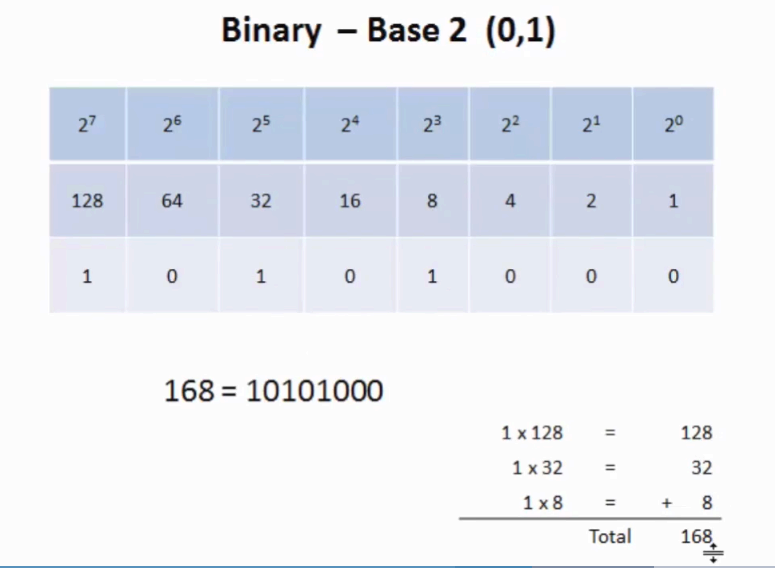
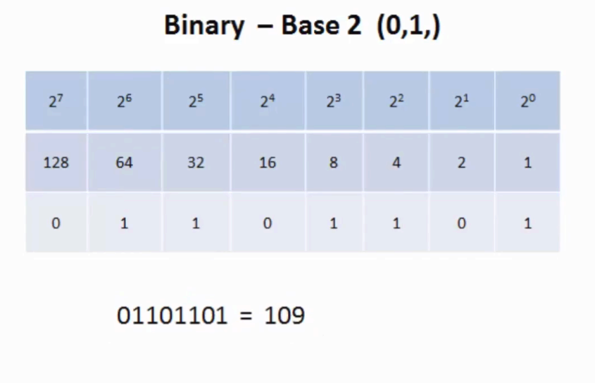
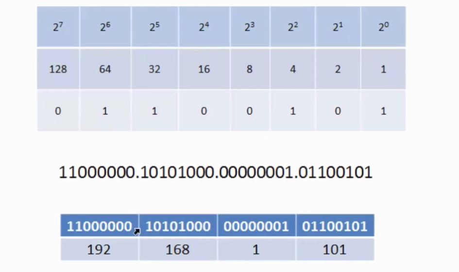
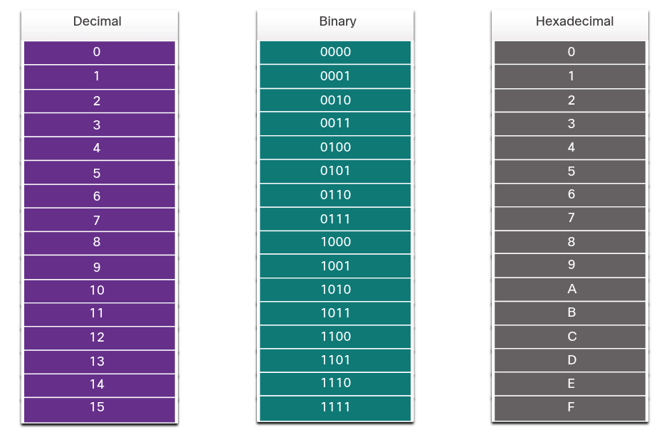
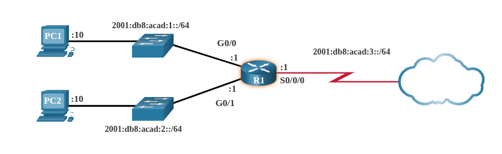
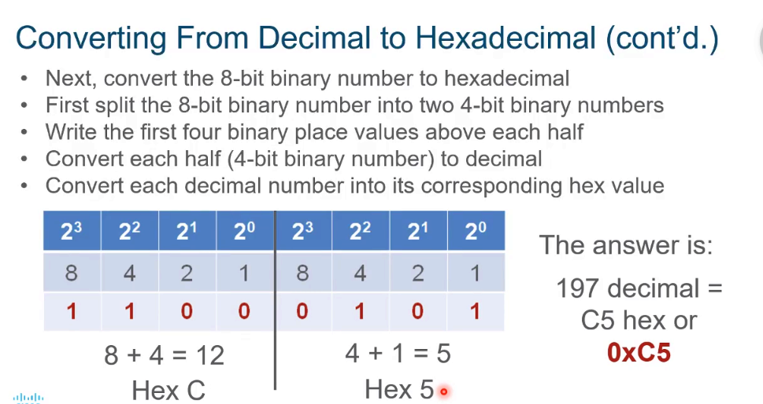
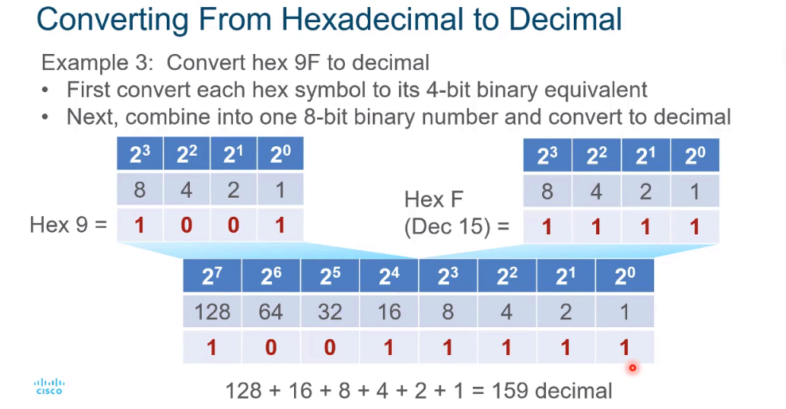

### Binary Systems

## Binary Number System
# Binary and IPv4 Addresses
    IPv4 addresses begin as binary, a series of only 1s and 0s. These are difficult to manage, so network administrators must convert them to decimal.
    Binary is a numbering system that consists of digits 0 and 1 called bits. In contrast, the decimal numbering system consists of 10 digits which includes 0 through 9.
    Binary is important for us to understand because hosts, servers, and network device use binary addressing. Specifically, they use binary IPv4 addresses, as shown in the figure below, to identify each other.

        

    Each address consists of a string of 32 bits, divided into four sections called octets. Each octet contains 8 bits (or 1 byte) separated with a dot. For example, PC1 in the figure above is assigned IPv4 address 11000000.10101000.00001010.00001010. It's default gateway address would be that of R1 Gigabit Ethernet interface 11000000.10101000.00001010.00000001. Binary works well with hosts and network devices. However, it is very challenging for humans to work with.

    For ease of use by people, IPv4 addresses are commonly expressed in dotted decimal notation. PC1 in the figure below, is assigned with the IPv4 address 192.168.10.10, and it's default gateway address is 192.168.10.1.

        

    For a solid understanding of networking addressing, it is necessary to know binary addressing and gain practical skills converting between binary and dotted decimal IPv4 addresses.

# Converting between Binary and Decimal Numbering Systems

    
    
    

## Hexadecimal Number System
    Just as decimal is a base ten number system, hexadecimal is a base sixteen system. The base sixteen number system uses the digits 0 to 9 and the letters A to F. The figure below shows the equivalent decimal and hexadecimal values for binary 0000 to 1111.

        

    Binary and hexadecimal work well together because it is easier to express a value as a single hexadecimal digit than as four binary bits.
    The hexadecimal numbering system is used in networking to represent IP Version 6 addresses and Ethernet MAC addresses.
    IPv6 addresses are 128 bits in length and every 4 bits is represented by a single hexadecimal digit; for a total of 32 hexadecimal values. IPv6 addresses are not case-sensitive and can be written in either lowercase or uppercase.

    As shown in the figure below, the preferred format for writing an IPv6 address is x:x:x:x:x:x:x:x, with each “x” consisting of four hexadecimal values. When referring to 8 bits of an IPv4 address we use the term octet. In IPv6, a hextet is the unoffical term used to refer to a segment of 16 bits or four hexadecimal values. Each "x" is a single hextet, 16 bits, or four hexadecimal digits.

        

# Converting between hexadecimal and decimal numbering system
    To convert decimal to hexadecimal:
        First, convert the decimal number to binary number.
        Next, convert the 8 bit-binary number to hexadecimal.
        Then split the 8-bit binary number into two 4-bit binary numbers.
        Write the first four binary place values above each half.
        Convert each half (4-bit binary number) to decimal.
        Lastly, convert each decimal number into its corresponding hex value.

            

    To convert hexadecimal to decimal:
        First, convert each hex symbol to its 4-bit binary equivalent.
        Next, combine into one 8-bit binary number and convert to decimal

            

