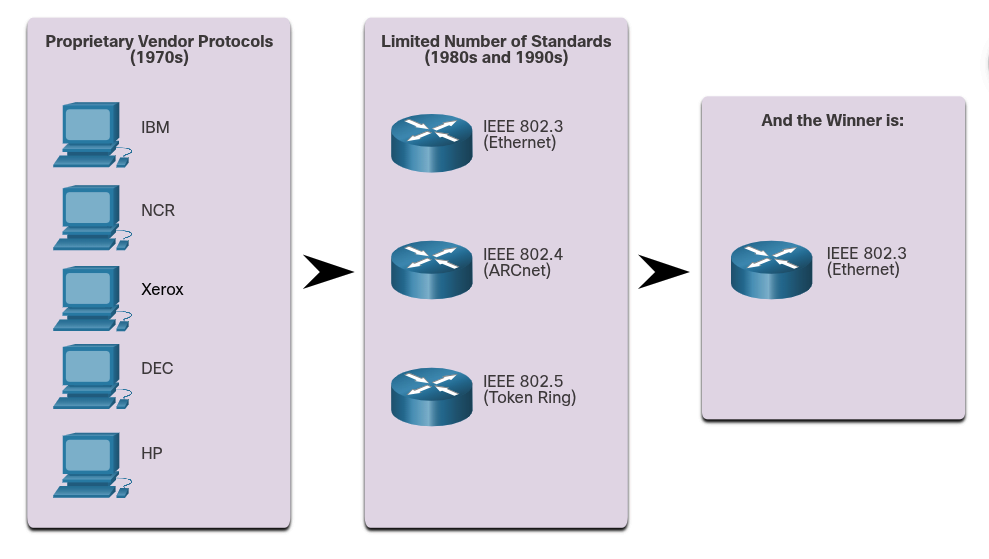
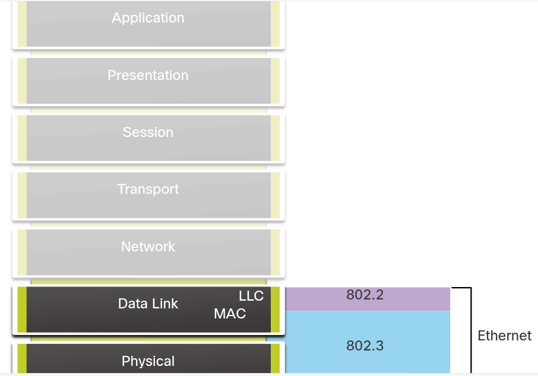
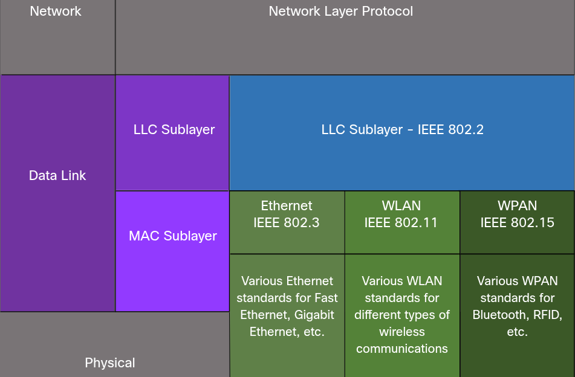
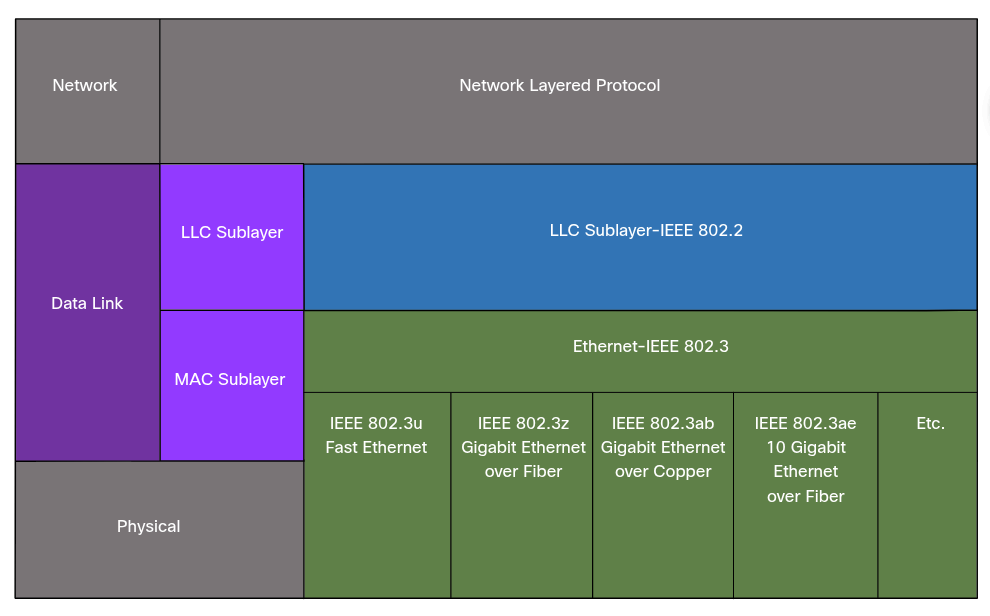
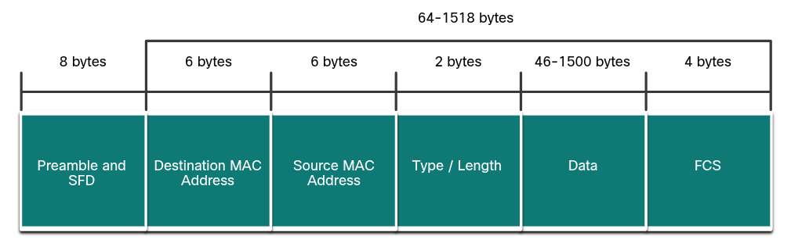

### Ethernet Switching

## Ethernet
# The Rise of Ethernet
    In the early days of networking, each vendor used its own proprietary methods of interconnecting network devices and networking protocols. If you bought equipment from different vendors, there was no guarantee that the equipment would work together. Equipment from one vendor might not communicate with equipment from another.
    As networks became more widespread, standards were developed that defined rules by which network equipment from different vendors operated. Standards are beneficial to networking in many ways:
        Facilitate design
        Simplify product development
        Promote competition
        Provide consistent interconnections
        Facilitate training
        Provide more vendor choices for customers

    There is no official local area networking standard protocol, but over time, one technology, Ethernet, has become more common than the others. Ethernet protocols define how data is formatted and how it is transmitted over the wired network. The Ethernet standards specify protocols that operate at Layer 1 and Layer 2 of the OSI model. Ethernet has become a de facto standard, which means that it is the technology used by almost all wired local area networks, as shown in the figure below.
        

# Ethernet Evolution
    "The Institute of Electrical and Electronics Engineers, or IEEE", maintains the networking standards, including Ethernet and wireless standards. IEEE committees are responsible for approving and maintaining the standards for connections, media requirements and communications protocols. Each technology standard is assigned a number that refers to the committee that is responsible for approving and maintaining the standard. The committee responsible for the Ethernet standards is 802.3.
    Since the creation of Ethernet in 1973, standards have evolved for specifying faster and more flexible versions of technology. This ability for Ethernet to improve over time is one of the main reasons that it has become so popular. Each version of Ethernet has an associated standard. For example, 802.3 100BASE-T represents the 100Megabit Ethernet using twisted-pair cable standards. The standard notation translates as:
        100 is the speed in Mbps
        BASE stands for baseband transmission
        T stands for the type of cable, in this case, twisted-pair
    Early versions of Ethernet were relatively slow at 10Mbps. The latest versions of Ethernet operate at 10 Gigabits per second and more.

## Ethernet Frames
# Ethernet Encapsulation
    Ethernet and The OSI Model
        Ethernet is one of two LAN technologies used today, with the other being wireless LANs (WLANs). Ethernet uses wired communications, including twisted pair, fiber-optic links, and coaxial cables.
        Ethernet operates in the data link layer and the physical layer. It is a family of networking technologies defined in the IEEE 802.2 and 802.3 standards. Ethernet supports data bandwidths of the following:
            10 Mbps
            100 Mbps
            1000 Mbps (1 Gbps)
            10,000 Mbps (10 Gbps)
            100,000 Mbps (100 Gbps)
        As shown in the figure below, Ethernet standards define both the Layer 2 protocols and the Layer 1 technologies.
            

# Data Link Sublayers
    IEEE 802 LAN/MAN protocols, including Ethernet, use the following two separate sublayers of the data link to operate. They are the Logical Link Control (LLC) and the Media Access Control (MAC), as show in the figure below.

        LLC Sublayer
            This IEEE 802.2 sublayer communicates between the networking software at the upper layers and the device hardware at the lower layers. It places information in the frame that identifies which network layer protocol is being used for the frame. This information allows multiple Layer 3 protocols, such as IPv4 and IPv6, to use the same network interface and media.
        MAC Sublayer
            This sublayer (IEEE 802.3, 802.11, or 802,15 for example) is implemented in hardware and is responsible for data encapsulation and media access control. It provides data link layer addressing and is intergrated with various physical layer technologies.

        

# MAC sublayer
    Ethernet Standards in the MAC Sublayer
        The MAC sublayer is responsible for data encapsulation and accessing the media.
        Data Encapsulation
        IEEE 802.3 data encapsulation includes the following:

            Ethernet frame
                This is the internal structure of the Ethernet frame
            Ethernet Addressing
                The Ethernet frame includes both a source and destination MAC address to deliver the Ethernet frame from Ethernet NIC to Ethernet NIC on the same LAN.
            Ethernet Error detection
                The Ethernet frame includes a frame check sequence (FCS) trailer used for error detection.

        Accessing the Media
            As shown in the figure below, the IEEE 802.3 MAC sublayer includes the specificawtions for different Ethernet communications standards over various types of media including copper and fiber.

                

        Legacy Ethernet using a bus topology or hubs, is a shared, half-duplex medium. Ethernet over a half-duplex medium uses a contention-based access method, carrier sense multiple access/collision detection (CSMA/CD). This ensures that only one device is transmitting at a time. CSMA/CD (Carrier Sense Multiple Access with Collision Detection) allows multiple devices to share the same half-duplex medium, detecting a collision when more than one device attempts to transmit simultaneously. It also provides a back-off algorithm for retransmission.
        Ethernet LANs of today use switches that operate in full-duplex. Full-duplex communications with Ethernet switches do not require access control through CSMA/CD.

# Ethernet Frame Fields
    The minimum Ethernet frame size is 64 bytes and the expected maximum is 1518 bytes. This includes all bytes from the destination MAC address field through the frame check sequence (FCS) field. The preamble field is not included when describing the size of the frame.

    Note: The frame size may be large if additional requirements are includes, such as VLAN tagging. VLAN tagging is beyond the scope of this scope.

    Any frame less than 64 byyes in length is considered a "collision fragment" or "runt frame" and is automatically discarded by receiving stations. Frames with more than 1500 bytes of data is considered "jumbo" or "baby giant frames".

    If the size of a transmitted frame is less than the minimum, or greater than the maximum, the receiving device drops the frame. Dropped frames are likely to be the result of the collisions or other unwanted signals. They are considered invalid. Jumbo frames are usually supported by most Fast Ethernet and Gigabit Ethernet switches and NICs.

    The figure below shows each field in the Ethernet frame.
        

