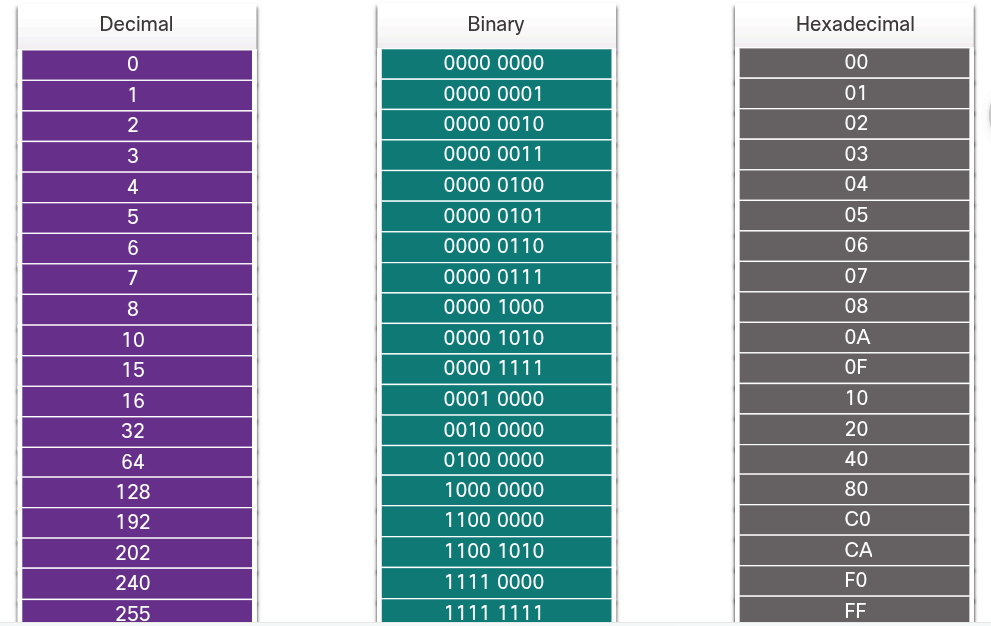

### Ethernet Switching

## Ethernet
# The Rise of Ethernet
    In the early days of networking, each vendor used its own proprietary methods of interconnecting network devices and networking protocols. If you bought equipment from different vendors, there was no guarantee that the equipment would work together. Equipment from one vendor might not communicate with equipment from another.
    As networks became more widespread, standards were developed that defined rules by which network equipment from different vendors operated. Standards are beneficial to networking in many ways:
        Facilitate design
        Simplify product development
        Promote competition
        Provide consistent interconnections
        Facilitate training
        Provide more vendor choices for customers

    There is no official local area networking standard protocol, but over time, one technology, Ethernet, has become more common than the others. Ethernet protocols define how data is formatted and how it is transmitted over the wired network. The Ethernet standards specify protocols that operate at Layer 1 and Layer 2 of the OSI model. Ethernet has become a de facto standard, which means that it is the technology used by almost all wired local area networks, as shown in the figure below.
        

# Ethernet Evolution
    "The Institute of Electrical and Electronics Engineers, or IEEE", maintains the networking standards, including Ethernet and wireless standards. IEEE committees are responsible for approving and maintaining the standards for connections, media requirements and communications protocols. Each technology standard is assigned a number that refers to the committee that is responsible for approving and maintaining the standard. The committee responsible for the Ethernet standards is 802.3.
    Since the creation of Ethernet in 1973, standards have evolved for specifying faster and more flexible versions of technology. This ability for Ethernet to improve over time is one of the main reasons that it has become so popular. Each version of Ethernet has an associated standard. For example, 802.3 100BASE-T represents the 100Megabit Ethernet using twisted-pair cable standards. The standard notation translates as:
        100 is the speed in Mbps
        BASE stands for baseband transmission
        T stands for the type of cable, in this case, twisted-pair
    Early versions of Ethernet were relatively slow at 10Mbps. The latest versions of Ethernet operate at 10 Gigabits per second and more.

## Ethernet Frames
# Ethernet Encapsulation
    Ethernet and The OSI Model
        Ethernet is one of two LAN technologies used today, with the other being wireless LANs (WLANs). Ethernet uses wired communications, including twisted pair, fiber-optic links, and coaxial cables.
        Ethernet operates in the data link layer and the physical layer. It is a family of networking technologies defined in the IEEE 802.2 and 802.3 standards. Ethernet supports data bandwidths of the following:
            10 Mbps
            100 Mbps
            1000 Mbps (1 Gbps)
            10,000 Mbps (10 Gbps)
            100,000 Mbps (100 Gbps)
        As shown in the figure below, Ethernet standards define both the Layer 2 protocols and the Layer 1 technologies.
            

# Data Link Sublayers
    IEEE 802 LAN/MAN protocols, including Ethernet, use the following two separate sublayers of the data link to operate. They are the Logical Link Control (LLC) and the Media Access Control (MAC), as show in the figure below.

        LLC Sublayer
            This IEEE 802.2 sublayer communicates between the networking software at the upper layers and the device hardware at the lower layers. It places information in the frame that identifies which network layer protocol is being used for the frame. This information allows multiple Layer 3 protocols, such as IPv4 and IPv6, to use the same network interface and media.
        MAC Sublayer
            This sublayer (IEEE 802.3, 802.11, or 802,15 for example) is implemented in hardware and is responsible for data encapsulation and media access control. It provides data link layer addressing and is intergrated with various physical layer technologies.

        

# MAC sublayer
    Ethernet Standards in the MAC Sublayer
        The MAC sublayer is responsible for data encapsulation and accessing the media.
        Data Encapsulation
        IEEE 802.3 data encapsulation includes the following:

            Ethernet frame
                This is the internal structure of the Ethernet frame
            Ethernet Addressing
                The Ethernet frame includes both a source and destination MAC address to deliver the Ethernet frame from Ethernet NIC to Ethernet NIC on the same LAN.
            Ethernet Error detection
                The Ethernet frame includes a frame check sequence (FCS) trailer used for error detection.

        Accessing the Media
            As shown in the figure below, the IEEE 802.3 MAC sublayer includes the specificawtions for different Ethernet communications standards over various types of media including copper and fiber.

                

        Legacy Ethernet using a bus topology or hubs, is a shared, half-duplex medium. Ethernet over a half-duplex medium uses a contention-based access method, carrier sense multiple access/collision detection (CSMA/CD). This ensures that only one device is transmitting at a time. CSMA/CD (Carrier Sense Multiple Access with Collision Detection) allows multiple devices to share the same half-duplex medium, detecting a collision when more than one device attempts to transmit simultaneously. It also provides a back-off algorithm for retransmission.
        Ethernet LANs of today use switches that operate in full-duplex. Full-duplex communications with Ethernet switches do not require access control through CSMA/CD.

# Ethernet Frame Fields
    The minimum Ethernet frame size is 64 bytes and the expected maximum is 1518 bytes. This includes all bytes from the destination MAC address field through the frame check sequence (FCS) field. The preamble field is not included when describing the size of the frame.

    Note: The frame size may be large if additional requirements are includes, such as VLAN tagging. VLAN tagging is beyond the scope of this scope.

    Any frame less than 64 byyes in length is considered a "collision fragment" or "runt frame" and is automatically discarded by receiving stations. Frames with more than 1500 bytes of data is considered "jumbo" or "baby giant frames".

    If the size of a transmitted frame is less than the minimum, or greater than the maximum, the receiving device drops the frame. Dropped frames are likely to be the result of the collisions or other unwanted signals. They are considered invalid. Jumbo frames are usually supported by most Fast Ethernet and Gigabit Ethernet switches and NICs.

    The figure below shows each field in the Ethernet frame.
        

## Ethernet MAC Address
    Decimal and Binary Equivalents of 0 to F Hexadecimal
        In networking, IPv4 addresses are represented using the decimal base ten number system and the binary base 2 number system. IPv6 addresses and Ethernet addresses are represented using the hexadecimal base sixteen number system.
        The hexadecimal numbering system uses the numbers 0 to 9 and the letters A to F.
        An Ethernet MAC address consists of a 48-bit binary value. Hexadecimal is used to identify an Ethernet address because a single hexadecimal digit represents four binary bits. Therefore, a 48-bit Ethernet MAC address can be expressed using only 12 hexadecimal values.

    Selected Decimal, Binary, and Hexadecimal Equivalents
        Given that 8 bits (one byte) is a common binary grouping, binary 00000000 to 11111111 can be represented in hexadecimal as the range 00 to ff, as shown in the figure below.

            

        When using hexadecimal, leading zeroes are always displayed to complete the 8-bit representation. Example, in the image above, the binary value 0000 1010 is shown in hexadecimal as 0A.

        Hexadecimal numbers are often represented by the value preceded by 0x (e.g., 0x73) to distinguish between decimal and hexadecimal values in documentation.

        Hexadecimal may also be represented by a subscript 16, or the hex number followed by a H (e.g., 73H).

# Unicast MAC address
    In Ethernet, different MAC addresses are used for Layer 2 unicast, broadcast, and multicast communications.

    A unicasts MAC address is the unique address that is used when a frame is sent from a single transmitting device to a single destination device.

    For a unicast packet to be sent and received, a destinatio IP address must be in the IP packet header. A corresponding destination MAC address must also be present in the Ethernet frame header. The IP address and MAC address combine to deliver data to one specific destination host.

    The process that a source host uses to determine the destination MAC address associated with an IPv4 address is known as Address Resolution Protocol (ARP). The process that a source host uses to determine the destination MAC address associated with an IPv6 address is known as Neighbor Discovery (ND).

    Note: The source MAC address must always be a unicast.

# Broadcast MAC Address
    An Ethernet broadcast frame is received and processed by every device on the Ethernet LAN. The features of an Ethernet broadcast are as follows:

        It has a destination MAC address of FF-FF-FF-FF-FF-FF in hexadecimal (48 ones in binary).
        It is flooded out all Ethernet switch ports except the incoming port.
        It is not forwarded by a router.

    If the encapsulated data is an IPv4 broadcast packet, this means the packet contains a destination IPv4 address that has all ones (1s) in the host portion. This numbering in the address means that all hosts on that local network (broadcast domain) will receive and process the packet.

    When the IPv4 broadcast packet is encapsulated in the Ethernet frame, the destination MAC address is the broadcast MAC address of FF-FF-FF-FF-FF-FF in hexadecimal (48 ones in binary).

    DHCP for IPv4 is an example of a protocol that uses Ethernet and IPv4 broadcast addresses.

    However, not all Ethernet broadcasts carry an IPv4 broadcast packet. For example, ARP Requests do no use IPv4, but the ARP message is sent as an Ethernet broadcast.

# Multicast MAC Address
    An Ethernet multicast frame is received and processed by a group of devices on the Ethernet LAN that belong to the same multicast group. The features of an Ethernet multicast are as follows:

        There is a destination MAC address of 01-00-5E when the encapsulated data is an IPv4 multicast packet and a destination MAC address of 33-33 when the encapsulated data is an IPv6 multicast packet.
        There are other reserved multicast destination MAC address for when the encapsulated data is not IP, such as Spanning Tree Protocol (STP) and Link Layer Discovery Protocol (LLDP).
        It is flooded out all Ethernet switch ports except the incoming port, unless the switch is configured for multicast snooping.
        It is not forwarded by a router, unless the router is configured to route multicast packets.

    If the encapsulate data is an IP multicast packet, the devices that belong to a multicast group are assigned a multicast group IP address. The range of IPv4 multicast addresses is 224.0.0.0 to 239.255.255.255. The range of IPv6 multicast addresses begins with ff00::/8. Because multicast addresses represent a group of addresses (sometimes called a host group), they can only be used as the destination of a packet. The source will always be a unicast address.

    As with the unicast and broadcast addresses, the multicast IP address requires a corresponding multicast MAC address to deliver frames on a local network. The multicast MAC address is associated with, and uses addressing information from, the IPv4 or IPv6 multicast address.

    Routing protocols and other network protocols use multicast addressing. Applications such as video and imaging software may also use multicast addressing, although multicast applications are not as common.

## The MAC Address Table
    Switch Fundamentals
        A switch uses these Ethernet MAC addresses to forward (or discard) frames to other devices on a network. If a switch just forwarded every frame it received out all ports, the network would be so congested that it would probably come to a complete half.

        A Layer 2 Ethernet switch uses LAyer 2 MAC addresses to make forwarding decisions. It is completely unaware of the data (protocol) being carried in the data portion of the frame, such as an IPv4 packet, an ARP message, or an IPv6 ND packet. The switch makes it forwarding decisions based solely on the Layer 2 Ethernet MAC addresses.

        An Ethernet switch examines its MAC address table to make a forwarding decision for each frame, unlike legacy Ethernet hubs that repeat bits out all ports except the incoming port.

        NOTE: The MAC address table is sometimes reffered to as a content addressable memory (CAM) table.

# Switch Learning and Forwarding
    The switch dynamically builds the MAC address table by examining the source MAC address of the frames received on a port. The switch forwards frames by searching for a match between the destination MAC address in the frame and an entry in the MAC address table.

        Learn
            Examine the Source MAC Address
                Every frame that enters a switch is checked for new information to learn. It does this by examining the source MAC address of the frame and the port number where the frame entered the switch. If the source MAC address does not exist, it is added to the table along with the incoming port number. If the source MAC address does exist, the switch updates the refresh timer for that entry in the table. By default, most Ethernet switches keep an entry in the table for 5 minutes.

                NOTe: If the source MAC address does exist in the table but on a different port, the switch treats this as a new entry. The entry is replaced using the same MAC address but with the more current port number.

        Forward
            Find the Destination MAC Address
                If the destination MAC Address is a unicast address, the switch will look for a match between the destination MAC address of the frame and an entry in its MAC address table. If the destination MAC address is in the table, it will forward the frame out the specified port. If the destination MAC address is not in the table, the switch will forward the frame out all ports except the incoming port. This is called an unknown unicast.

                NOTE: If the destination MAC address is a broadcast or a multicast, the frame is also flooded out all ports except the incoming port.

# Filtering Frames
    As a switch receives frames from different devices, it is able to populate its MAC address table by examining the source MAC address of every frame. When the MAC address table of the switch contains the destination MAC address, it is able to filter the frame and forward out a single port.

# MAC Address Tables on Connected Switches
    A switch can have multiple MAC addresses associated with a single port. This is common when the switch is connected to another switch. The switch will have a separate MAC address table entry for each frame received with a different source MAC address.

# Send the Frame to the Default Gateway
    When a device has an IP address that is on a remote network, the Ethernet frame cannot be sent directly to the destination device. Instead, the Ethernet frame is sent to the MAC address of the default gateway, the router.

