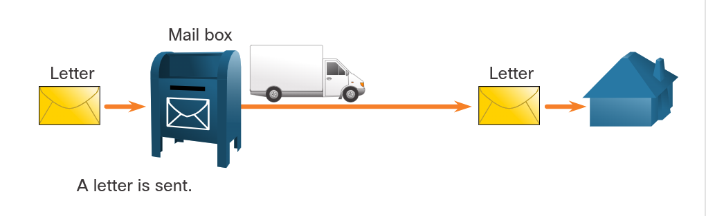
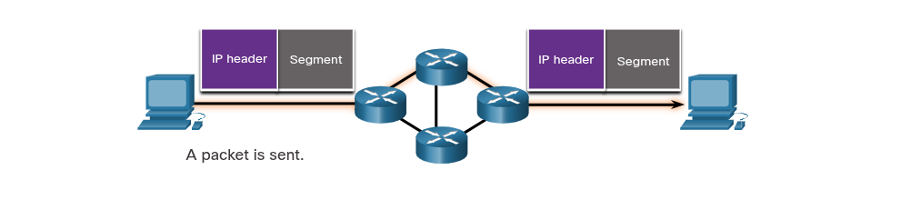
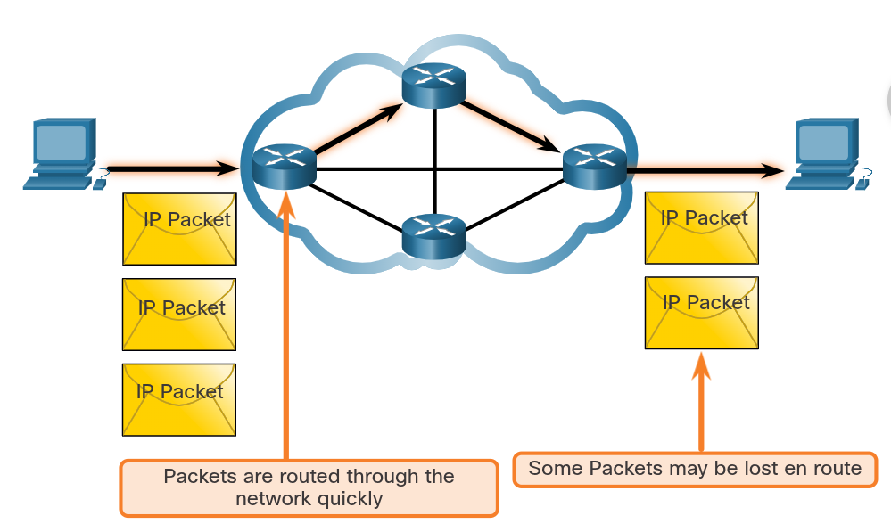
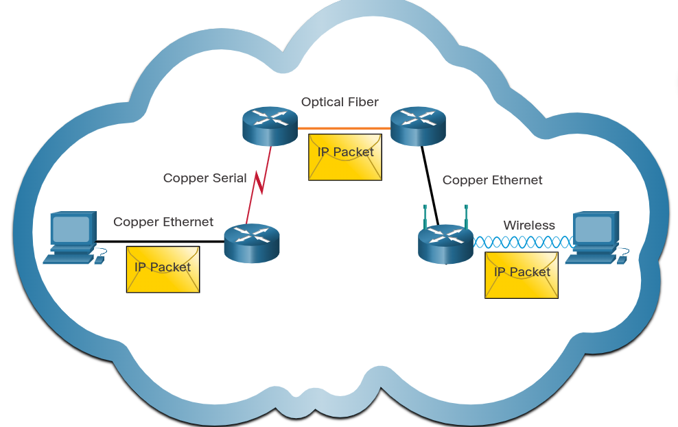
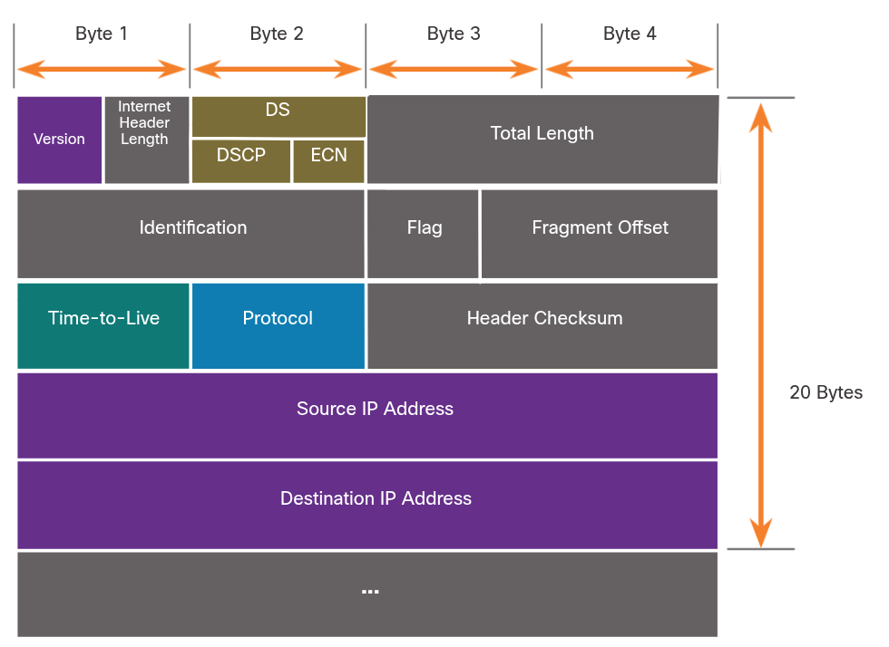
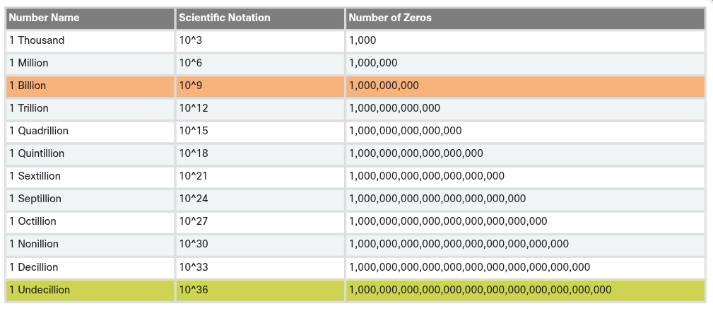
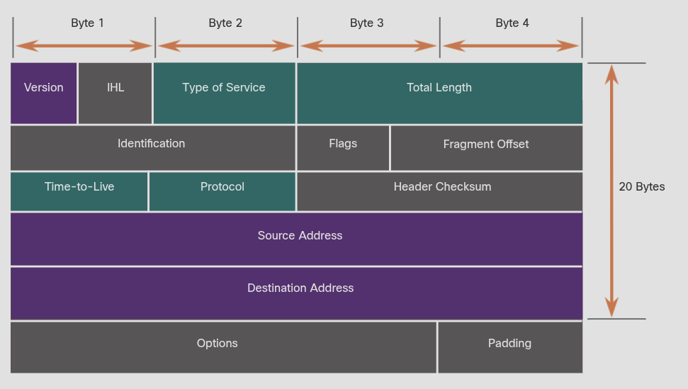
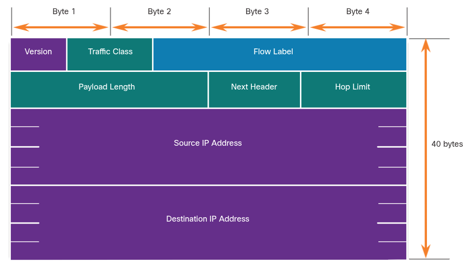
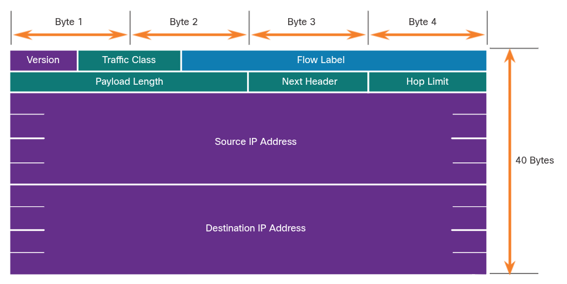

### Network Layer Characteristics

## Data Encapsulation
## The Network Layer
    Network Layer Protocols
        The network layer, or OSI Layer 3, provides services to allow end devices to exchange data across networks. IP version 4 (IPv4) and IP version 6 (IPv6) are the principle network layer communication protocols. Other network layer protocols include routing protocols such as Open Shortest Path First (OSPF) and messaging protocols such as Internet Control Message Protocols (ICMP).

        To accomplist end-to-end communications across network boundaries, network layer protocols perform four basic operations:

            Addressing end devices
                End devices must be configured with a unique IP address for identification on the network.

            Encapsulation
                The network layer encapsulates the protocol unit (PDU) from the transport layer into a packet. The encapsulation process adds IP header information, such ash the IP address of the source (sending) and destination (receiving) hosts. The encapsulation process is performed by the source of the IP packet.

            Routing
                The network layer provides services to direct the packets to a destination host on another network. To travel to other networks, the packet must be processed by a router. The role of a router is to select the best path and direct packets toward the destination host in a process known as routing. A packet may cross many routers before reaching the destination host. Each router a packet crosses to reach the destination host is called a hop.

            De-encapsulation
                When the packet arrives at the network layer of the destination host, the host checks the IP header of the packet. If the destination IP address within the header matches its own IP address, the IP header is removed from the packet. After the packet is de-encapsulated by the network layer, the resulting Layer 4 PDU is passed up to the appropriate service at the packet layer. The de-encapsulation process is performed by the destination host of the IP packet.

        Unlike the transport layer (OSI Layer 4), which manages the data transport between the processes running on each host, network layer communication protocols (i.e., IPv4 and IPv6) specify the packet structure and processing used to carry the data from one host to another host. Operating without regard to the data carried in each packet allows the network packets for multiple types of communication between multiple hosts.

            Example:
                Host A to Host B
                    Data — Layer 7 (Application)
                    Segment — Layer 4 (Transport) — TCP/UDP header added
                    Packet — Layer 3 (Network) — IP header added
                    Frame — Layer 2 (Data Link) — MAC header/trailer added
                            Layer 1 (Physical) — frame converted into Bits and physically transmitted to Host B

                    Data → Segment → Packet → Frame → Bits
                    (L7)    (L4)      (L3)     (L2)    (L1)

# IP Encapsulation
    IP encapsulates the transport layer (the layer just above the network layer) segment or other data by adding an IP header. The IP header is used to deliver the packet to the destination host.

    The process of encapsulating data layer by layer enables the services at the different layers to develop and scale without affecting the other layers. This means the transport layer segments can be readily packaged by IPv4 and IPv6 or by any new protocol that might be developed in the future.

    The IP header is examined by Layer 3 devices (i.e., routers and Layer 3 switches) as it travels across a network to its destination. It is important to note, that the IP addressing information remains the same from the time the packet leaves the source host until it arrived at the destination host, except when translated by the device performing Network Address Translation (NAT) for IPv4.

    Routers implement routing protocols to route packets between networks. The routing performed by these intermediary devices examines the network layer addressing in the packet header. In all cases, the data portion of the packet, that is, the encapsulated transport layer PDU or other data, remains unchanged during the network layer processes.

# Characteristics of IP
    IP was designed as a protocol with low overhead. It provides only the functions that are necessary to deliver a packet from a source to a destination over a interconnected system of networks. The protocols was not designed to track and manage the flow of packets. These functions, if required, are performed by other protocols at other layers, primarily at TCP at Layer 4.

    These are the basic characteristics of IP:

        Connectionless
            There is no connection with the destination established before sending data packets.
        Best Effort
            IP is inherently unreliable because packet delivery is not guaranteed.
        Media Independent
            Operation is independent of the medium (i.e., copper, fiber-optic, or wireless) carrying the data.

# Connectionless
    Connectionsless - Analogy
        IP is connectionless, meaning that no dedicated end-to-end is created by IP before data is sent. Connectionless communication is conceptually similar to sending a letter to someone without notifying the recipient in advance. The figure summarizes this key point.

            

    Connectionless - Network
        Connectionless data communications work on the same principle. IP requires no initial exchange of control information to establish an end-to-end connection before packets are forwarded.

            

# Best Effort
    IP also does not require additional fields in the header to maintain an establish connection. This process greatly reduces the overhead of IP. However, with no pre-established end-to-end connection, senders are unaware whether destination devices are present and functional when sending packets, nor are they aware if the destination receives the packet, or if the destination device is able to access and read the packet.

    The IP protocol does not guarantee that all packets that are delivered are, in fact, received. The figure illustrates the unreliable or best-effort delivery characteristic of the IP protocol.

        

# Media Independent
    Unreliable means that IP does not have the capaility to manage and recover from undelivere or corrupt packets. This is because while IP packets are sent with information about the location of delivery, they do not contain information that can be processed to inform the sender whether delivery was successful. Packets may arrive at the destination corrupted, out of sequence, or not at all. IP provides no capability for packet retransmission if error occur.

    If out-of-order packets are delivered, or packets are missing, then applications using the data, or upper layer services, must resolve these issues. This allows IP to function very efficiently. In the TCP/IP protocol suite, reliability is the role of the TCP protocol at the transport layer.

    IP operates independently of the media that carry the data at lower layers of the protocol stack. As shown in the figure below, IP packets can be communicated as electronic signals over copper cable, as optical signals over fiber, or wirelessly as radio signals.

            

    The OSI data link layer is responsible for taking an IP packet and preparing it for transmission over the communications mediu. This means that the delivery of IP packets in not limited to any particular medium.

    There is, however, one major characteristic of the media that the network layer considers: the maximum size of the PDU that each medium can transport. This characteristic is referred to as the maximum transmission unit (MTU). Part of the control communication between the data link layer and the network layer is the establishment of a maximum size for the packet. The data link layer passes the MTU value up to the network layer. The network layer then determines how large packets can be. In some cases, an intermediate device, usually a router, must split up an IPv4 packet when forwarding it from one medium to another medium with a smaller MTU. This process is called fragmenting the packet, or fragmentation. Fragmentation causes latency. IPv6 packets cannot be fragmented by the router.

## IPv4 Packet
# IPv4 Packet Header
    IPv4 is one of the primary network layer communication protocols. The IPv4 packet header is used to ensure that this packet is delivered to its next stop on the way to its destination end device.

    An IPv4 packet header consists of fields containing important information about the packet. These fields contain binary numbers which are examined by the Layer 3 process.

# IPv4 Packet Header Fields
    The binary values of each field identify various settings of the IP packet. Protocol header diagrams, which are read left to right, and top down, provide visual to refer to when discussing protocol fields. The IP protocol header diagram in the figure below identifies the fields of an IPv4 packet.

        

    Significant fields in the IPv4 header include the following:

        Version
            Contains a 4-bit binary value set to 0100 that identifies as an IPv4 packet
        Differentiated Services or DiffServ (DS)
            Formerly called the type of service (ToS) field, the DS field is an 8-bit field used to determine the priority of each packet. The six most significant bits of the DiffServ field are the differentiated services code point (DSCP) bits that the last two bits are the explicit congestion notification (ECN) bits.
        Time to Live (TTL)
            TTL contains an 8-bit binary value that is used to limit the lifetime of a packet. The source device of the IPv4 packet sets the initial TTL value. It is decreased by one each time the packet is processed by a router. If the TTL field decrements to zero, the router discards the packet and sends an Internet Control Message Protocol (ICMP) Time Exceeded message to the source IP address. Because the router decrements the TTL of each packet, the router must also recalculate the Header Checksum.
        Header Checksum
            This is used to detect corruption in the IPv4 header
        Source IPv4 Address
            This contains a 32-bit binary value that represents the source IPv4 address of the packet. The source IPv4 address is always a unicast address.
        Destination IPv4 Address
            This contains a 32-bit binary value that represents the destination IPv4 address of the packet. The destination IPv4 address is a unicast, multicast, or broadcast address.

    The two most commonly referenced fields are the source and destination IP addresses. These fields identify where the packet is coming and where it is going. Typically, these addresses do not change while travelling from the source to the destination.

    The Internet Header Length (IHL), Total Length, and Header Checksum fields are used to identify and validate the packet.

    Other fields are used to reorder a fragmented packet. Specifically, the IPv4 packet uses Identification, Flags, and Fragment Offset fields to keep track of the fragments. A router may have to fragment an IPv4 packet when forwarding it from one medium to another with a smaller MTU.

## IPv6 Packets
# Limitations of IPv4
    IPv4 is still in use today. This topic is about IPv6, which will eventually IPv4. To better understand why you need to know the IPv6 protocol, it helps to know the limitations and the advantages of IPv6.

    Through the years, additional protocols and processes have been developed to address new challenges. However, even with changes, IPv4 still has three major issues:

        IPv4 address depletion
            IPv4 has a limited number of unique public addresses available. Although there are approximately 4 billion IPv4 addresses, the increasing number of new IP-enabled devices, always-on connections, and the potential growth of less-developed regions have increased the need for more addresses.
        Lack of end-to-end connectivity
            Network Address Translation (NAT) is a technology commonly implemented within IPv4 networks. NAT provides a way for multiple devices to share a single public IPv4 address. However, because the public IPv4 address is shared, the IPv4 address of an internal network host is hidden. This can be problematic for techologies that require end-to-end connectivity.
        Increased network complexity
            While NAT has extended the lifespan of IPv4, it was only meant as a transition mechanism to IPv6. NAT in its various implementation creates additional complexity in the network, creating latency and making troubleshooting more difficult.

# IPv6 Overview
    In the early 1990s, the Internet Engineering Task Force (EITF) grew concerned about the issues with IPv4 and began to look for a replacement. This activity led to the development of IP version 6 (IPv6). IPv6 overcomes the limitations of IPV4 and is a powerful enhancement with features that better suit current and foreseeable network demands.

    Improvements that IPv6 provides include the following:

        Increased address space
            IPv6 addresses are based on 128-bit hierarchical addressing as opposed to IPv4 with 32 bits.
        Improved packet handling
            The IPv6 header has been simplified with fewer fields.
        Eliminates the need for NAT
            With such a large number of public IPv6 addresses, NAT between a private IPv4 address and a public IPv4 is not needed. This avoids some of the NAT-induced problems experienced by applications that require end-to-end connectivity.

    The 32-bit IPv4 address space provides approximately 4,294,967,296 unique addresses. IPv6 address space provides 340,282,366,920,938,463,463,374,607,431,768,211,456, or 349 undeciliion addresses. This is roughly equivalent to every grain of sand on Earth.

    The figure below provides a visual to compare IPv4 and IPv6 address space.

        

# IPv4 Packet Header Fields in the IPv6 Packet Header
    One of the major design improvements of IPv6 over IPv4 is the simplified IPv6 header.

    For example, the IPv6 header consists of a variable length header of 20 octets (up to 60 bytes if the Options field is used) and12 basic header fields, not including the Options field and Padding field.

    For IPv6, some fields have remained the same, some fields have changed names and positions, and some IPv4 fields are no longer required.

        Below is the image of the IPv4 packet header:
            

    In contrast, the simplified IPv6 header shown  below consists of a fixed length header of 40 octets (largely due to the length of the source and destination IPv6 addresses).

    The IPv6 simpplified header allows for more efficient processing of IPv6 headers.

        Below is the image of the IPv6 packet header:
            

# IPv6 Packet Header
    The IP protocol header diagram in the figure below identifies the fields of an IPv6 packet.

        

    The fields in the IPv6 packet header include the following:

        Version
            This field contains a 4-bit binary value set to 0110 that identifies this an IP version 6 packet.
        Traffic Class
            This 8-bit field is equivalent to the IPv4 Differentiated Services (DS) field.
        Flow Label
            This 2-bit field suggests that all packets with the same flow label receive the same type of handling by routers.
        Payload Strength
            This 16-bit field indicates the length of the data portion or payload of the IPv6 packet. THis does not icnlude the length of the IPv6 header, which is a fixed 40-byte header.
        Next Header
            This 8-bit field is equivalent to the IPv4 Protocol field. It indicates the payload type that the packet is carrying, enabling the network layer to pass the data to the appropriate upper-layer protocol.
        Hop Limit
            This 8-bit field replaces the IPv4 TTL field. This value is decremented by a value of 1 by each router that forwards the packet. When the counter reaches 0, the packet is discarded, and an ICMPv6 Time Exceeded message is forwarded to the sending host. This indicates that the packet did not reach its destination because the hop limit was exceeded. Unlike IPv4, IPv6 does not include an IPv6 Header Checksum, because this function is performed at both the lower and upper layers. This means the checksum does not need to be recalculated by each router when it decrements the Hop Limit field, which also improves network performance.
        Source IPv6 Address
            This 128-bit field identifies the IPv6 address of the sending host.
        Destination IPv6 Address
            Ths 128-bit field identifies the IPv6 address of the receiving host.

    Sn IPv6 packet may also contain extension headers (EH), whcih provide optional network layer information. Extension headers are optional and are placed between the IPv6 header and the payload. EHs are used for fragmentation, security, to support mobility and more.

    Unlike IPv4, routers do not fragment routed IPv6 packets.

