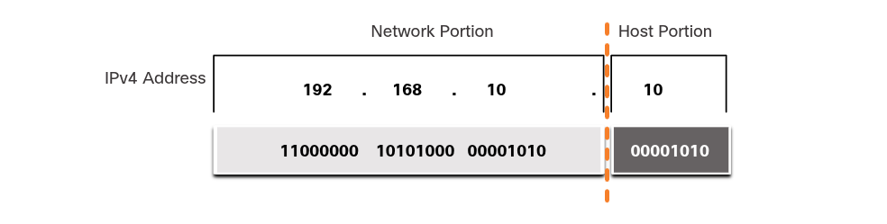
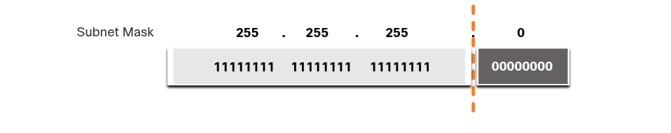
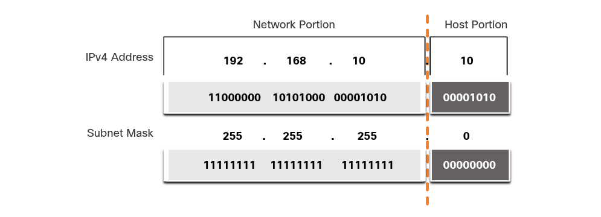
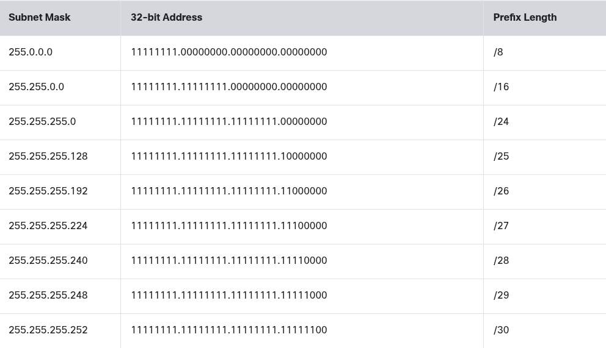
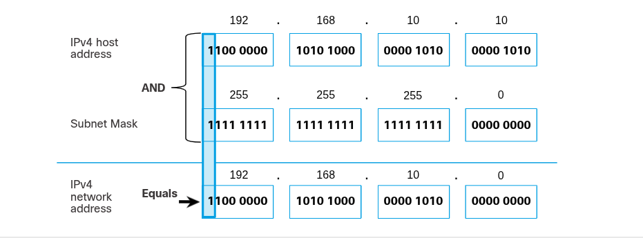

### IPv4 Address Structure

##
# Network and Host Portions
    IPv4 Address
        An IPV4 address is a 32-bit hierarchical address that is made up of a network portion and a host portion. When determining the network portion versus the host portion, you must look at the 32-bit stream, as shown in the figure below.

            

        The bits within the network portion of the address must be identical for all devices that reside in the same network. The bits within the host portion of the address must be unique to identify a specific host within a network. If two hosts have the same bit-pattern in the specified network portion of the 32-bit stream, those two hosts will reside in the same network.

        But how do hosts know which portion of the 32-bits identifies the network and which identifies the host? That is the role of the subnet mask.

# The Subnet Mask
    Assigning an IPv4 address to a host requires the following:

        IPv4 address
            This is the unique IPv4 address of the host
        Subnet mask
            This is used to identify the network/host portion of the IPv4 address

    A default gateway IPv4 address is required to reach remote networks and DNS server IPv4 addresses are required to translate domain names to IPv4 addresses.

    The IPv4 subnet mask is used to differentiate the network portion from the host portion of an IPv4 address. When an IPv4 address is assigned to a device, the subnet mask is used to determine the network address of the device. The network address represents all the devices on the same network.

    The figure below displays the 32-bit subnet mask in dotted decimal and binary formats.

        

    Notice how the subnet mask is a consecutive sequence of 1 bits followed by a consecutive sequence of 0 bits.

    To identify the network and host portions of an IPv4 address, the subnet mask is compared to the IPv4 address bit for bit, from left to right, as shown in the figure below.

        

    Note that the subnet mask does not actually contain the network or host portion of an IPv4 address, it just tells the computer where to look for the part of the IPv4 address that is the network portion and which part is the host portion.

    The actual process used to identify the network portion and host portion is called ANDing.

# The Prefix Length
    Expressing network addresses and host addresses with the dotted decimal subnet mask address can become cumbersome. Fortunately, there is an alternative method of identifying a subnet mask, a method called the prefix length.

    The prefix length is the number of bits set to 1 in the subnet mask. It is written in "slash notation", which is noted by a forward slash (/) followed by the number of bits set to 1. Therefore, count the number of bits in the subnet mask and prepend it with a slash.

    In the figure below, the first column lists various subnet masks that can be used with a host address. The second column displays the converted 32-bit binary address. The last column displays the resulting prefix length.

        

    NOTE: A network address is also referred to as a prefix or network prefix. Therefore, the prefix length is the number of 1 bits in the subnet mask.

    When representing an IPv4 address using a prefix length, the IPv4 address is written followed by the prefix length with no spaces. For example, 192.168.10.10 255.255.255.0 would be written as 192.168.10.10/24.

# Determining the Network: Logical AND
    A logical AND is one of three Boolean operations used in Boolean or digital logic. The other two are OR and NOT. The AND operation is used in determining the network address.

    Logical AND is the comparison of two bits that produce the results shown below. Note how only a 1 AND 1 produces a 1. Any other combination results in 0.

        1 AND 1 = 1
        0 AND 1 = 0
        1 AND O = 0
        0 AND 0 = 0

    NOTE: In digital logic, 1 represents True and 0 represents False. When using an AND operation, both input values must be True (1) for the result to be True (1).

    To identify the network address of an IPv4 host, the IPv4 address is logically ANDed, bit by bit, with the subnet mask. ANDing between the address and the subnet mask yields the network address.

    To illustrate how AND is used to discover a network address, consider a host with IPv4 address 192.168.10.10 and subnet mask of 255.255.255.0, as shown in the figure below:

        

        IPv4 host address (192.168.10.10)
            The IPv4 address of the host in dotted decimal and binary formats.
        Subnet mask (255.255.255.0)
            The subnet mask of the host in dotted decimal and binary formats.
        Network address (192.168.10.0)
            The logical AND operation between the IPv4 address and subnet mask results in an IPv4 network address shown in dotted decimal and binary formats.

    Using the first sequence of bits as an example, notice the AND operation is performend on the 1-bit of the host address with the 1-bit of the subnet mask. This results in a 1 bit for the network address. 1 AND 1 = 1.

    The AND operation between an IPv4 host address and subnet mask results in the IPV4 network address for this host. In this example, the AND operation between the host address of 192.168.10.10 and the subnet mask 255.255.255.0(/24), results in the IPv4 network address of 192.168.10.0/24. This is an important IPv4 operation, as it tells the host what network it belongs to.

# Conclusion
    An IPv4 address is a 32-bit hierarchical address that is made up of a network porton and a host portion. When determining the network portion versus the host portion, look at the 32-bit stream. The bits within the network portion of the address must be identical for all devices that reside in the same network. The bits within the host portion of the address must be unique to identify a specific host within a network. If two hosts have the same bit-pattern in the specified network portion of the 32-bit stream, those two hosts will reside in the same network.

    The IPv4 subnet mask is used to differentiate the network portion from the host portion of an IPv4 address. When an IPv4 address is assigned to a device, the subnet mask is used to determine the network address of the device. The network address represents all the devices on the same network.

    To identify the network address of an IPv4 host, the IPv4 address is logically ANDed, bit by bit, with the subnet mask. ANding between the address and the subnet mask yields the network address.
