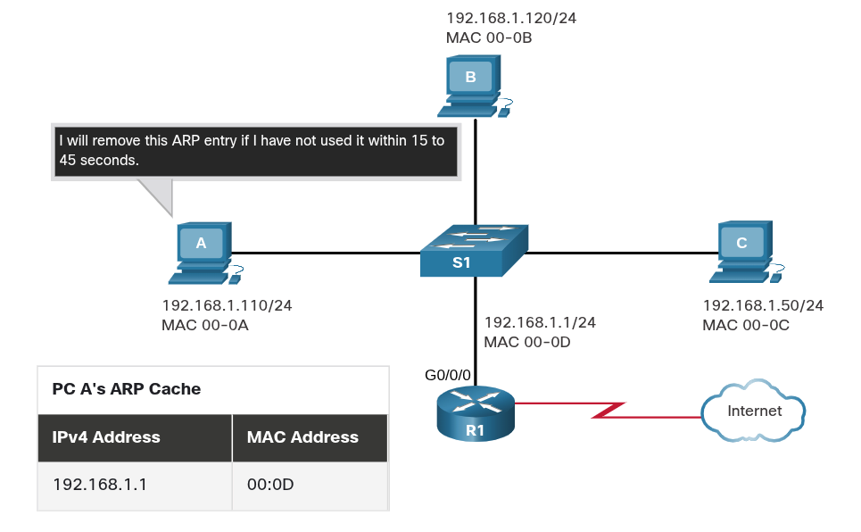
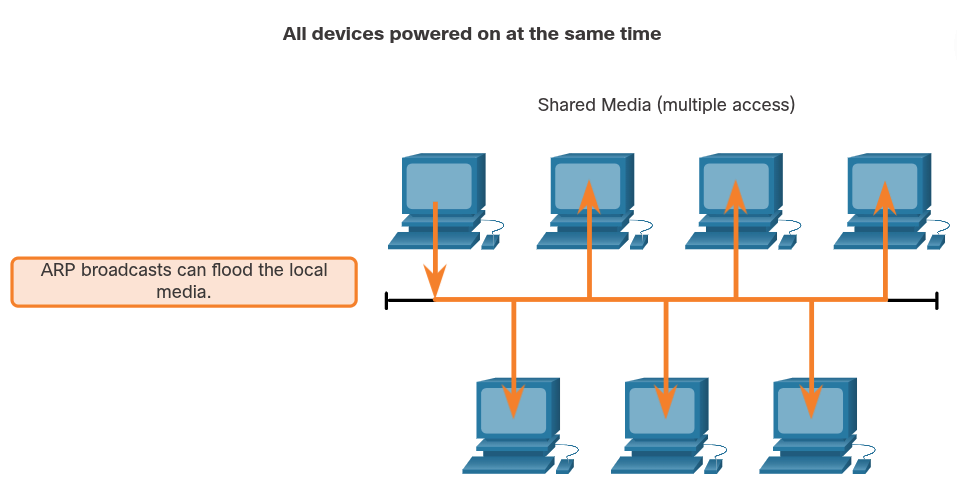
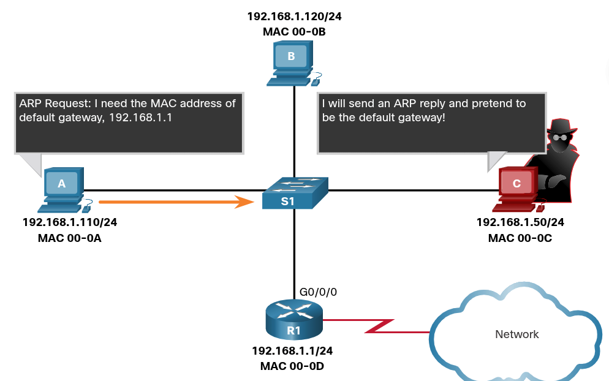

### Address Resolution

## ARP
# ARP Overview
    If a network is using the IPv4 communications protocol, the Address Resolution Protocol, or ARP, is what needed to map IPv4 addresses to MAC addresses.

    Every IP device on the Ethernet network has a unique Ethernet MAC address. When a device sends an Ethernet Layer 2 frame, it contains these two addresses:

        Destination MAC address
            The Ethernet MAC address of the destination device on the same local network segment. If the destination host is on another network, then the destination address in the frame would be that of the default gateway (i.e., router).

        Source MAC address
            The MAC address of the Ethernet NIC on the source host

    To send a packet to another host on the same local IPv4 network, a host must know the IPv4 address and the MAC address of the destination device. Device destination IPv4 addresses are either known or resolved by device name. However, MAC addresses must be discovered.

    A device uses Address Resolution Protocol (ARP) to determine the destination MAC address of a local device when it knows its IPv4 address.

    ARP provides two basic functions:

        Resolving IPv4 addresses to MAC addresses
        Maintaining a table of IPv4 to MAC address mappings

# ARP Functions
    When a packet is sent to the data link layer to be encapsulated into an Ethernet frame, the device refers to a table in its memory to find the MAC address that is mapped to the IPv4 address. This table is stored temporarily in RAM memory and called the ARP table or the ARP cache.

    The sending device will search its ARP table for a destination IPv4 address and a corresponding MAC addres.

        If the packet's destination IPv4 address is on the same network as the source IPv4 address, the device will search the ARP table for the destination IPv4 address.

        If the destination IPv4 address is on a different network than the source IPv4 address, the device will search the ARP table for the IPv4 address of the default gateway.

    In both cases, the search is for an IPv4 address and a corresponding MAC address for the device.

    Each entry, or row, of the ARP table binds an IPv4 address with a MAC address. We call the relationship between the two values a map. This simply means that you can locate an IPv4 address in the table and discover the corresponding MAC address. The ARP table temporarily saves (caches) the mapping for the devices on the LAN.

    If the device locates the IPv4 address, its corresponding MAC address is used as the destination MAC address in the frame. If there is no entry is found, the the device sends an ARP request.

# ARP Operation - ARP Request
    An ARP request is sent when a device needs to determine the MAC address that is associated with an IPv4 address, and it does not have an entry for the IPv4 address in its ARP table.

    ARP messages are encapsulated directly within an Ethernet frame. There is no IPv4 header. The ARP request is encapsulated in an Ethernet frame using the following header information:

        Destination MAc address
            This is a broadcast address FF-FF-FF-FF-FF-FF requiring all Ethernet NICs on the LAN to accept and process the ARP request.
        Source MAC address
            This is MAC address of the sender of the ARP request.
        Type
            ARP messages have a type field of 0x806. This informs the receiving NIC that the data portion of the frame needs to be passed to the ARP process

    Because ARP requests are broadcasts, they are flooded out all ports by switch, except the receiving port. All Ethernet NICs on the LAN process broadcasts and must deliver the ARP request to its operating system for processing. Every device must process the ARP request to see if the target IPv4 address matches its own. A router will not forward broadcasts out other interfaces.

    Only one device on the LAN will have an IPv4 address that matches the target IPv4 address in the ARP request. All other devices will not reply.

# ARP Reply
    Only the device with the target IPv4 address associated with the ARP request will respond with an ARP reply. The ARP reply is encapsulated in an Ethernet frame using the following header information:

        Destination MAC address
            This is the MAC address of the sender of the ARP request.
        Source MAC address
            This is the MAC address of the sender of the ARP reply.
        Type
            ARP messages have a type field of 0x806. This informs the receiving NIC that the data portion of the frame needs to be passed to the ARP process.

    Only the device that originally sent the ARP request will receive the unicast ARP reply. After the ARP reply is received, the device will add the IPv4 address and the corresponding MAC address to its ARP table. Packets destined for that IPv4 address can now be encapsulated in frames using its corresponding MAC address.

    If no device responds to the ARP request, the packet is dropped because a frame cannot be created.

    Entries in the ARP table are time stamped. If a device does not receive a frame from a particular device before the timestamp expires, the entry for this device is removed from the ARP table.

    Additionally, static map entries can be entered in an ARP table, but this is rarely done. Static ARP table entries do not expire over time and must be manually removed.

    NOTE: IPv6 uses a similar process to ARP for IPv4, known as ICMPv6 Neighbor Discovery (ND). IPv6 uses neighbor solicitation and neighbor advertisement messages, similar to IPv4 ARP requests and ARP replies.

# ARP Role in Remote Communications
    When the destination IPv4 address is not on the same network as the source IPv4 address, the source device needs to send the frame to its default gateway. This is the interface of the local router. Whenever a source device has a packet with an IPv4 address on another network, it will encapsulate that packet in a frame using the destination MAC address of the router.

    The IPv4 address of the default gateway is stored in the IPv4 configuration of the hosts. When a host creates a packet for a destination, it compares the destination IPv4 address and its own IPv4 address to determine if the two IPv4 addresses are located on the same Layer 3 network. If the destination host is not on its same network, the source checks its ARP table for an entry with the IPv4 address of the default gateway. If there is not an entry, it uses the ARP process to determine a MAC address of the default gateway.

# Removing Entries from an ARP Table
    For each device, an ARP cache timer removes ARP entries that have not been used for a specified period of time. The time differ depending on the operating system of the device. For example, newer Windows operating systems store ARP table entries between 15 to 45 seconds, as illustrated in the figure.

        

    Commands may also be used to manually remove some or all the entries in the ARP table. After an entry has been removed, the process for sending an ARP request and receiving and ARP reply must occur again to enter the map in the ARP table.

# ARP Issues - ARP Broadcasts and ARP Spoofing
    As a broadcast frame, an ARP request is received and processed by every device on the local network. On a typical business network, these broadcasts would probably have minimal impact on network performace. However, if a large number of devices were to be powered up and start accessing network services at the same time, there could be some reduction in performance for a short period of time, as shown in the figure below. After the devices send out the initial ARP broadcasts and have learned the necessary MAC addresses, any impact on the network will be minimized.

        

    In some cases, the use of ARP can lead to a potential security risk. A threat actor can use ARP spoofing to perform an ARP poisoning attack. This is a technique used by a threat actor to reply to an ARP request for an IPv4 address that belongs to another device, such as the default gateway, as shown in the figure below. The threat actor sends an ARP reply with its own MAC address. The receiver of the ARP reply will add the wrong MAC address to its ARP table and send these packets to the threat actor.
    Enterprise level switches include mitigation techniques known as dynamic ARP inspection (DAI). DAI is beyond the scope of this course.

        
