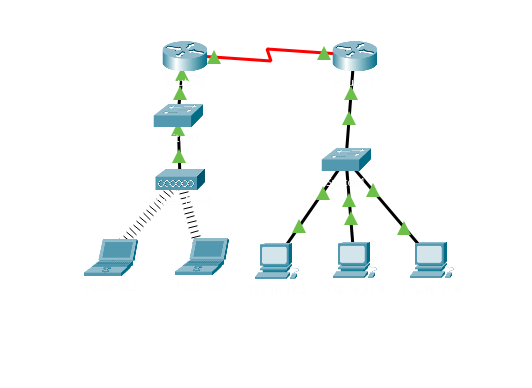

## Examine the ARP Table
# Objectives
    Part 1: Examine an ARP Request
    Part 2: Examine a Switch MAC Address Table
    Part 3: Examine the ARP Process in Remote Communications

# Topology
    - Describe the devices used:
        - 2 routers
        - 2 switches
        - 1 access point
        - 2 laptops
        - 3 pcs
        

# Configuration Summary
    - Part 1
        Open "Command Prompt" and ping 172.16.31.3 from 172.16.31.2. Below is the prompt:

            Cisco Packet Tracer PC Command Line 1.0
            C:\>ping 172.16.31.3

            Pinging 172.16.31.3 with 32 bytes of data:

            Reply from 172.16.31.3: bytes=32 time=15ms TTL=128
            Reply from 172.16.31.3: bytes=32 time<1ms TTL=128
            Reply from 172.16.31.3: bytes=32 time<1ms TTL=128
            Reply from 172.16.31.3: bytes=32 time<1ms TTL=128

            Ping statistics for 172.16.31.3:
                Packets: Sent = 4, Received = 4, Lost = 0 (0% loss),
            Approximate round trip times in milli-seconds:
                Minimum = 0ms, Maximum = 15ms, Average = 3ms

        Enter "arp -d" command to clear the ARP table.

        Enter the command "ping 172.16.31.3" again. The ping command cannot completed the ICMP packet without knowing the MAC address of the destination. So the computer sends an ARP broadcast frame to find the MAC address of the destination.

        
